project3
================
12/08/2021

<!-- #Above is the header. there are options to change formatting if the default doesn't suit your style -->
<!-- #Below is an example of an r code chunk, Code->Insert Chunk (or Ctrl+Alt+I / Cmd+Option +I) the r means it is an r code chunk, the next word is the chunk title, and after the comma is chunk options--->

``` r
#Load in libraries 
library(ncdf4)
library(lubridate)
```

    ## 
    ## Attaching package: 'lubridate'

    ## The following objects are masked from 'package:base':
    ## 
    ##     date, intersect, setdiff, union

``` r
library(ggplot2)
library(tidyverse)
```

    ## -- Attaching packages --------------------------------------- tidyverse 1.3.1 --

    ## v tibble  3.0.6     v dplyr   1.0.4
    ## v tidyr   1.1.4     v stringr 1.4.0
    ## v readr   1.4.0     v forcats 0.5.1
    ## v purrr   0.3.4

    ## -- Conflicts ------------------------------------------ tidyverse_conflicts() --
    ## x lubridate::as.difftime() masks base::as.difftime()
    ## x lubridate::date()        masks base::date()
    ## x dplyr::filter()          masks stats::filter()
    ## x lubridate::intersect()   masks base::intersect()
    ## x dplyr::lag()             masks stats::lag()
    ## x lubridate::setdiff()     masks base::setdiff()
    ## x lubridate::union()       masks base::union()

``` r
#install.packages("ggthemes")
library(ggthemes)
#install.packages("forecast")
library(forecast)
```

    ## Registered S3 method overwritten by 'quantmod':
    ##   method            from
    ##   as.zoo.data.frame zoo

``` r
library(reshape2)
```

    ## 
    ## Attaching package: 'reshape2'

    ## The following object is masked from 'package:tidyr':
    ## 
    ##     smiths

``` r
library(zoo)
```

    ## 
    ## Attaching package: 'zoo'

    ## The following objects are masked from 'package:base':
    ## 
    ##     as.Date, as.Date.numeric

``` r
#install.packages ("ggfortify")
library(ggfortify)
```

    ## Registered S3 methods overwritten by 'ggfortify':
    ##   method                 from    
    ##   autoplot.Arima         forecast
    ##   autoplot.acf           forecast
    ##   autoplot.ar            forecast
    ##   autoplot.bats          forecast
    ##   autoplot.decomposed.ts forecast
    ##   autoplot.ets           forecast
    ##   autoplot.forecast      forecast
    ##   autoplot.stl           forecast
    ##   autoplot.ts            forecast
    ##   fitted.ar              forecast
    ##   fortify.ts             forecast
    ##   residuals.ar           forecast

``` r
library(magrittr) # needs to be run every time you start R and want to use %>%
```

    ## 
    ## Attaching package: 'magrittr'

    ## The following object is masked from 'package:purrr':
    ## 
    ##     set_names

    ## The following object is masked from 'package:tidyr':
    ## 
    ##     extract

``` r
library(dplyr)    # alternatively, this also loads %>%
library(rgdal) # package for geospatial analysis
```

    ## Loading required package: sp

    ## Please note that rgdal will be retired by the end of 2023,
    ## plan transition to sf/stars/terra functions using GDAL and PROJ
    ## at your earliest convenience.
    ## 
    ## rgdal: version: 1.5-27, (SVN revision 1148)
    ## Geospatial Data Abstraction Library extensions to R successfully loaded
    ## Loaded GDAL runtime: GDAL 3.2.1, released 2020/12/29
    ## Path to GDAL shared files: C:/Users/70950/Documents/R/win-library/4.0/rgdal/gdal
    ## GDAL binary built with GEOS: TRUE 
    ## Loaded PROJ runtime: Rel. 7.2.1, January 1st, 2021, [PJ_VERSION: 721]
    ## Path to PROJ shared files: C:/Users/70950/Documents/R/win-library/4.0/rgdal/proj
    ## PROJ CDN enabled: FALSE
    ## Linking to sp version:1.4-6
    ## To mute warnings of possible GDAL/OSR exportToProj4() degradation,
    ## use options("rgdal_show_exportToProj4_warnings"="none") before loading sp or rgdal.
    ## Overwritten PROJ_LIB was C:/Users/70950/Documents/R/win-library/4.0/rgdal/proj

``` r
library(ggplot2) # package for plotting
library(sf)
```

    ## Linking to GEOS 3.9.1, GDAL 3.2.1, PROJ 7.2.1

``` r
library(rnaturalearth)
library(rnaturalearthdata)
library(ggspatial)
library(fields)
```

    ## Loading required package: spam

    ## Loading required package: dotCall64

    ## Loading required package: grid

    ## Spam version 2.7-0 (2021-06-25) is loaded.
    ## Type 'help( Spam)' or 'demo( spam)' for a short introduction 
    ## and overview of this package.
    ## Help for individual functions is also obtained by adding the
    ## suffix '.spam' to the function name, e.g. 'help( chol.spam)'.

    ## 
    ## Attaching package: 'spam'

    ## The following objects are masked from 'package:base':
    ## 
    ##     backsolve, forwardsolve

    ## Loading required package: viridis

    ## Loading required package: viridisLite

    ## 
    ## Try help(fields) to get started.

    ## 
    ## Attaching package: 'fields'

    ## The following object is masked from 'package:ggfortify':
    ## 
    ##     unscale

``` r
library(RColorBrewer)
library(magrittr) # needs to be run every time you start R and want to use %>%
library(dplyr)    # alternatively, this also loads %>%
library(lattice)
library(latticeExtra)
```

    ## 
    ## Attaching package: 'latticeExtra'

    ## The following object is masked from 'package:ggplot2':
    ## 
    ##     layer

``` r
library(reshape2)
library(maps)
```

    ## 
    ## Attaching package: 'maps'

    ## The following object is masked from 'package:viridis':
    ## 
    ##     unemp

    ## The following object is masked from 'package:purrr':
    ## 
    ##     map

# Part1: ExploratoryAnalysis

## Part1(a): Exploratory analysis for sst data

``` r
# reading the data
nc_sst_orig <- nc_open('F:\\courses\\STAT\\8330 data analysis 3\\project3\\SSTdata_011948_022018.nc')
nc_prec_orig <- nc_open('F:\\courses\\STAT\\8330 data analysis 3\\project3\\Pdata_011948_022018-1.nc')
##### sst variables 
zlev <- ncvar_get(nc_sst_orig, "zlev")
# East Longitude (deg)
X_sst <- ncvar_get(nc_sst_orig, "X")
print (dim(X_sst))
```

    ## [1] 84

``` r
# time from Jan. 1948 to Feb. 2018 
# 12*(2018-1948)+1(Jan 2018)+1(Feb 2018) = 842
time_sst <- ncvar_get(nc_sst_orig, "T")
#print (dim(time_sst))
# Latitude (deg)
Y_sst <- ncvar_get(nc_sst_orig, "Y")
#print (dim(Y_sst))
sst_anom <- ncvar_get(nc_sst_orig, "anom")
#print (dim(sst_anom))
#jpeg("sst_Feb2018.png", width=1600, height=1600, res=300)
image(x=X_sst, y=Y_sst, z=sst_anom[,,842], 
      col = hcl.colors(12, "YlOrRd", rev = TRUE),
      xlab="East Longitude (deg)",
      ylab="Latitude (deg)", main="sst Anomalies: Feb 2018")
```

<!-- -->

``` r
#dev.off()
##### precipitation variables
# East Longitude (deg)
X_prec <- ncvar_get(nc_prec_orig, "X")
#print (dim(X_prec))
# time 
time_prec <- ncvar_get(nc_prec_orig, "T")
#print (dim(time_prec))
# Latitude (deg)
Y_prec <- ncvar_get(nc_prec_orig, "Y")
#print (dim(Y_prec))
# Precipitation
prec <- ncvar_get(nc_prec_orig, "rain")
# reproduce the image in file
#jpeg("prec_Feb2018.png", width=1600, height=1600, res=300)
image(x=X_prec, y=Y_prec, z=prec[,,842], 
      col = hcl.colors(12, "YlOrRd", rev = TRUE),
      xlab="West Longitude (deg)",
      ylab="Latitude (deg)", main="Precipitation: Feb 2018")
```

<!-- -->

``` r
#dev.off()
```

``` r
lon_sst <- ncvar_get(nc_sst_orig,"X")
lat_sst <- ncvar_get(nc_sst_orig,"Y")
time_sst <- ncvar_get(nc_sst_orig,"T")
time_sst = time_sst * 30.42
time_sst <- as.Date(time_sst, origin="1960-1-1 00:00", tz="UTC")
sst_anom <- ncvar_get(nc_sst_orig, "anom")
sst_mean <- apply(sst_anom,3,mean,na.rm=TRUE)
tempseries <- data.frame(year=time_sst,sst=sst_mean)
tempseries %>% ggplot(aes(x=year,y=sst))+geom_line()+labs(title = "Monthly mean SST from January 1948 to Feburary 2018", x="year",y="Temperature" )
```

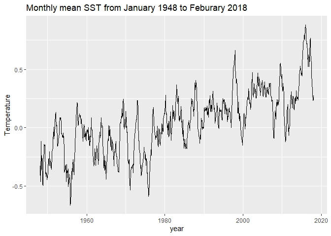<!-- -->

``` r
# Monthly mean,Annual mean and five years moving average
mov_avg <- tempseries %>% select(year, sst) %>% mutate(sst_1yr = rollmean(sst, k = 13, fill = NA, align = "right"), sst_5yr = rollmean(sst, k = 61, fill = NA, align = "right"))
mov_avg %>% gather(key="metrice",value = "value",sst:sst_5yr)%>% ggplot(aes(x=year,y=value,col=metrice))+
  geom_line()+scale_color_manual(values = c("bisque4","darkred","blue"),labels=c("Monthly mean","Annual mean","5 years moving Average"))+
  scale_x_date(limits =ymd(c("1948-01-01","2018-01-01")) ,breaks = seq(ymd("1948-01-01"),ymd("2018-01-01"),"10 years"),date_labels ="%Y")+ 
  scale_y_continuous(breaks = seq(23,33,0.5))+labs( x="year",y="SST [°C]" )+
  theme_clean(base_size = 12,)+
  theme(legend.title = element_blank(),legend.position = c("top"),legend.direction = "horizontal")
```

<!-- -->

``` r
# Decomposing the components of the additive time series
ts <- ts(sst_mean,start = c(1948,1),end = c(2018,2),frequency = 12,class = "ts")
#decomposition of ts object into trend,seasonality and error by additive model
decomposed <- decompose(ts, type = "additive")
#plot the components of an additive time series
theme_set(theme_bw())
autoplot(decomposed)
```

<!-- -->

``` r
#remove seasonality from the ts
decomposed_trend <- ts - decomposed$seasonal
# Plot the linear trend of seasonally adjusted time series
# make a dataframe of the trend 
set.seed(1)
decomposed_trend_df <- data.frame(date =as.Date(as.yearmon(time(decomposed_trend))),sst=as.matrix(decomposed_trend))
decomposed_trend_df %>% ggplot(aes(x=date, y=sst))+
  geom_line(alpha=0.8)+
  geom_smooth(method= "lm", se=FALSE, col="red") + geom_text(x =1940, y = 0.9, label = "y = 28.37 + 0.000027 x , r² = 0.486", hjust=1.5,colour="blue")+
  scale_x_date(limits =ymd(c("1948-01-01","2018-02-01")), breaks = seq(ymd("1948-01-01"), ymd("2018-02-01"),"10 years"), minor_breaks = "1 years", date_labels ="%Y")+
  labs(x="year",y="SST [°C]" )+ 
  scale_y_continuous(breaks = seq(25,32,0.2))+
  theme_clean()
```

    ## `geom_smooth()` using formula 'y ~ x'

<!-- -->

``` r
# Temporal variability of Seasonality
year=time_sst
ts_df <- data.frame(time=year, sst=sst_mean) 

ts_df <- ts_df %>% mutate(year=year(time)) %>% mutate(month= month(time,label=TRUE)) %>% mutate(season = case_when(month %in% c("Nov","Dec","Jan","Feb") ~ "Winter", month %in% c("Mar","Apr","May") ~ "Spring", month %in% c("Jun","Jul","Aug") ~ "Summer", month %in%  c("Sep","Oct") ~ "Fall", TRUE ~ NA_character_) ) %>% select(-time)  %>%  as_tibble()
ts_df$season <- as.factor(ts_df$season)
ts_df %>% ggplot(aes(x=month,y=sst,fill=season)) + geom_boxplot(position = position_dodge(width = 0.7))+scale_y_continuous(breaks = seq(20,35,0.5))+labs(x="month",y="SST [°C]")+scale_fill_manual(values = c("antiquewhite4","darkolivegreen4","chocolate4","cornflowerblue"))+theme_clean()+theme(legend.title = element_blank())
```

<!-- -->

``` r
sst_avg_grid = rowMeans(sst_anom,na.rm=FALSE,dims=2)
colors <- rev(brewer.pal(10, "RdYlBu"))
pal <- colorRampPalette(colors)
grid <- expand.grid(x=lon_sst, y=lat_sst)
grid$sst_avg <- as.vector(sst_avg_grid)
levelplot(sst_avg~x*y,grid,col.regions = pal(100),xlab='Longitude',ylab='Latitude',main='Average SST')
```

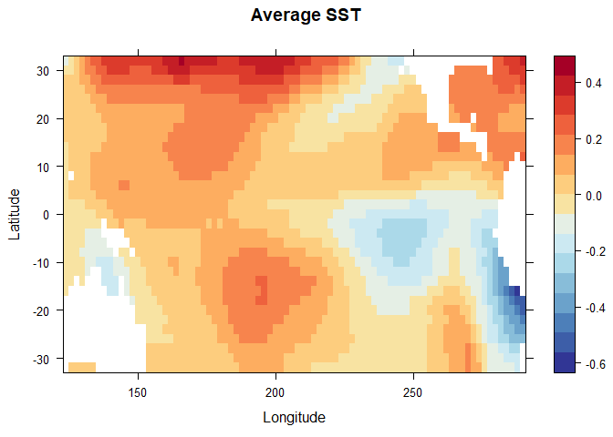<!-- -->

## Part1(b): Exploratory analysis for precipitation data

``` r
lon_prec <- ncvar_get(nc_prec_orig,"X")
lat_prec <- ncvar_get(nc_prec_orig,"Y")
time_prec <- ncvar_get(nc_prec_orig,"T")
time_prec = time_prec * 30.42
time_prec <- as.Date(time_prec, origin="1960-1-1 00:00", tz="UTC")
prec_mean <- apply(prec,3,mean,na.rm=TRUE)
tempseries <- data.frame(year=time_prec,prec=prec_mean)
tempseries %>% ggplot(aes(x=year,y=prec))+geom_line()+labs(title = "Monthly mean Precipitation from January 1948 to #Feburary 2018", x="year",y="Precipitation" )
```

<!-- -->

``` r
mov_avg <- tempseries %>% select(year, prec) %>% mutate(prec_1yr = rollmean(prec, k = 13, fill = NA, align = "right"), prec_5yr = rollmean(prec, k = 61, fill = NA, align = "right"))
mov_avg %>% gather(key="metrice",value = "value",prec:prec_5yr)%>% ggplot(aes(x=year,y=value,col=metrice))+
   geom_line()+scale_color_manual(values = c("bisque4","darkred","blue"),labels=c("Monthly mean","Annual mean","5 years moving Average"))+
   scale_x_date(limits =ymd(c("1948-01-01","2018-01-01")) ,breaks = seq(ymd("1948-01-01"),ymd("2018-01-01"),"10 years"),date_labels ="%Y")+ 
   scale_y_continuous(breaks = seq(23,33,0.5))+labs( x="year",y="Precipitation" )+
   theme_clean(base_size = 12,)+
   theme(legend.title = element_blank(),legend.position = c("top"),legend.direction = "horizontal")
```

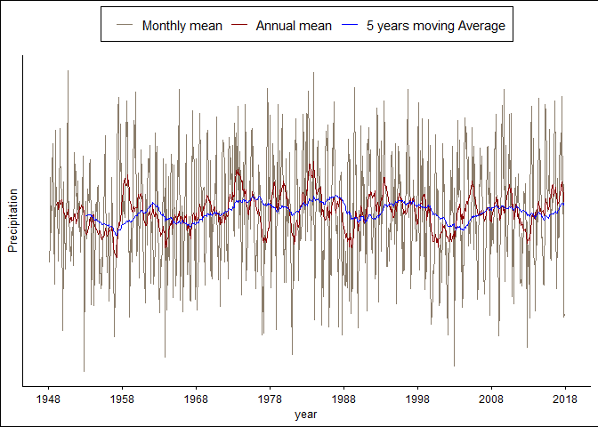<!-- -->

``` r
# Decomposing the components of the additive time series
ts <- ts(prec_mean,start = c(1948,1),end = c(2018,2),frequency = 12,class = "ts")
#decomposition of ts object into trend,seasonality and error by additive model
decomposed <- decompose(ts, type = "additive")
#plot the components of an additive time series
theme_set(theme_bw())
autoplot(decomposed)
```

<!-- -->

``` r
#remove seasonality from the ts
decomposed_trend <- ts - decomposed$seasonal
# Plot the linear trend of seasonally adjusted time series
# make a dataframe of the trend 
set.seed(1)
decomposed_trend_df <- data.frame(date =as.Date(as.yearmon(time(decomposed_trend))),sst=as.matrix(decomposed_trend))
decomposed_trend_df %>% ggplot(aes(x=date, y=sst))+
  geom_line(alpha=0.8)+
  geom_smooth(method= "lm", se=FALSE, col="red") + geom_text(x =1940, y = 0.9, label = "y = 28.37 + 0.000027 x , r² = 0.486", hjust=1.5,colour="blue")+
  scale_x_date(limits =ymd(c("1948-01-01","2018-02-01")), breaks = seq(ymd("1948-01-01"), ymd("2018-02-01"),"10 years"), minor_breaks = "1 years", date_labels ="%Y")+
  labs(x="year",y="Precipitation" )+ 
  scale_y_continuous(breaks = seq(25,32,0.2))+
  theme_clean()
```

    ## `geom_smooth()` using formula 'y ~ x'

<!-- -->

``` r
# Temporal variability of Seasonality
year=time_prec
ts_df <- data.frame(time=year, prec=prec_mean) 

ts_df <- ts_df %>% mutate(year=year(time)) %>% mutate(month= month(time,label=TRUE)) %>% mutate(season = case_when(month %in% c("Nov","Dec","Jan","Feb") ~ "Winter", month %in% c("Mar","Apr","May") ~ "Spring", month %in% c("Jun","Jul","Aug") ~ "Summer", month %in%  c("Sep","Oct") ~ "Fall", TRUE ~ NA_character_) ) %>% select(-time)  %>%  as_tibble()
ts_df$season <- as.factor(ts_df$season)
ts_df %>% ggplot(aes(x=month,y=prec,fill=season)) + geom_boxplot(position = position_dodge(width = 0.7))+scale_y_continuous(breaks = seq(20,35,0.5))+labs(x="month",y="Precipitation")+scale_fill_manual(values = c("antiquewhite4","darkolivegreen4","chocolate4","cornflowerblue"))+theme_clean()+theme(legend.title = element_blank())
```

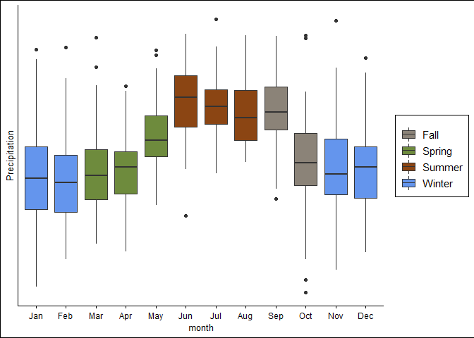<!-- -->

``` r
prec_avg_grid = rowMeans(prec,na.rm=FALSE,dims=2)
colors <- rev(brewer.pal(10, "RdYlBu"))
pal <- colorRampPalette(colors)
grid <- expand.grid(x=lon_prec, y=lat_prec)
grid$prec_avg <- as.vector(prec_avg_grid)
levelplot(prec_avg~x*y,grid,col.regions = pal(100),xlab='Longitude',ylab='Latitude',main='Average Precipitation')
```

<!-- -->

``` r
# write your code and push the changes. then I will merge the files to gether. 
# needed packages ---------------------------------------------------------
# uncomment install lines if you do not have the package and comment them after you are done!
#install.packages("ncdf4")
library(ncdf4) # package for netcdf manipulation
#install.packages("raster")
library(raster) # package for raster manipulation
```

    ## 
    ## Attaching package: 'raster'

    ## The following object is masked from 'package:dplyr':
    ## 
    ##     select

``` r
#install.packages("rgda1")
library(rgdal) # package for geospatial analysis
library(ggplot2) # package for plotting
# reading the data
nc_sst_orig <- nc_open('F:\\courses\\STAT\\8330 data analysis 3\\project3\\SSTdata_011948_022018.nc')
nc_prec_orig <- nc_open('F:\\courses\\STAT\\8330 data analysis 3\\project3\\Pdata_011948_022018-1.nc')
##### sst variables 
zlev <- ncvar_get(nc_sst_orig, "zlev")
# East Longitude (deg)
X_sst <- ncvar_get(nc_sst_orig, "X")
print (dim(X_sst))
```

    ## [1] 84

``` r
# time from Jan. 1948 to Feb. 2018 
# 12*(2018-1948)+1(Jan 2018)+1(Feb 2018) = 842
time_sst <- ncvar_get(nc_sst_orig, "T")
print (dim(time_sst))
```

    ## [1] 842

``` r
# Latitude (deg)
Y_sst <- ncvar_get(nc_sst_orig, "Y")
print (dim(Y_sst))
```

    ## [1] 33

``` r
sst_anom <- ncvar_get(nc_sst_orig, "anom")
print (dim(sst_anom))
```

    ## [1]  84  33 842

``` r
##### precipitation variables
# East Longitude (deg)
X_prec <- ncvar_get(nc_prec_orig, "X")
print (dim(X_prec))
```

    ## [1] 120

``` r
# time 
time_prec <- ncvar_get(nc_prec_orig, "T")
print (dim(time_prec))
```

    ## [1] 842

``` r
# Latitude (deg)
Y_prec <- ncvar_get(nc_prec_orig, "Y")
print (dim(Y_prec))
```

    ## [1] 50

``` r
# Precipitation
prec <- ncvar_get(nc_prec_orig, "rain")
na2zero <- function(x) ifelse(is.na(x), 0, x)
mean_all_prec <- sum((na2zero(prec)))/sum((!is.na(prec)))
prec[is.na(prec)]<-mean_all_prec
time_sst1 = time_sst * 30.42
time_sst2 <- as.Date(time_sst1, origin="1960-1-1 00:00", tz="UTC")
time_prec1 = time_prec * 30.42
time_prec2 <- as.Date(time_prec1, origin="1960-1-1 00:00", tz="UTC")
```

``` r
# precipitation over latitude for fixed long[mm/day], averaging for all the years
#jpeg("prec_fixedLong_Feb2018.png",width=1600, height=1000, res=250)
plot(Y_prec,prec[100,,842], 
     type="l", xlab="Latitude", ylab="Precipiation [mm/day]",
     main="prec.[mm/day] over latitude, fixed long. on Feb. 2018",
     lwd=3)
```

<!-- -->

``` r
#dev.off()
climMAT = matrix(0,nrow=120,ncol=50) #stoarge matrix for the climatology 
sdMAT = matrix(0,nrow=120,ncol=50) #storage matrix for the standard deviations
mon_rest=12*seq(0,69,1)+3 #months to look over
mon_jan_Feb=12*seq(0,70,1)+1 #months to look over
for (i in 1:120){
  for (j in 1:50) {climMAT[i,j]=mean(prec[i,j,mon_jan_Feb]); 
  sdMAT[i,j]=sd(prec[i,j,mon_jan_Feb]) 
  }
}
library(maps)
#jpeg("prec_meanoveryears.png",width=1600, height=1000, res=300)
int=seq(0,10,length.out=11)
rgb.palette=colorRampPalette(c('skyblue',  'green', 'blue', 'yellow', 'orange', 'pink','red', 
                               'maroon', 'purple', 'black'),interpolate='spline')
filled.contour(X_prec, Y_prec, climMAT, color.palette=rgb.palette, levels=int,
               plot.title=title(main="1948-2018 Precipitation",
                                xlab="Longitude", ylab="Latitude"),
               plot.axes={axis(1); axis(2);map('usa', add=TRUE);grid()},
               key.title=title(main="mm/day"))
```

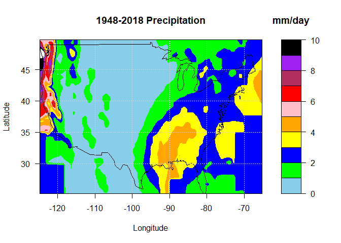<!-- -->

``` r
#dev.off()
```

``` r
# save Prec. file in .csv format
# with 844 columns, Lat, Long., each months(842)
precst=matrix(0,nrow=6000,ncol=842)
for (i in 1:842) {
  precst[,i]=as.vector(prec[ , , i])
}
# Replace NA with mean of all prec data
mean_all_prec <- sum((na2zero(precst)))/sum((!is.na(precst)))
precst[is.na(precst)]<-0
LAT=rep(Y_prec, each=120)
LON=rep(X_prec,50)
yr1=c(rep(1948:2017,each=12), rep(2018,2))
mon1=c(rep(1:12,70),1:2)
timehead=paste(yr1,"-",mon1)
colnames(precst)=timehead
precst2=cbind(LAT,LON,precst)
write.csv(precst2, file="prec_1948Jan18Feb.csv")
```

``` r
# sdMAT and climMAT are sd and mean for each months
# sdMAT and climMAT are [6000,14] --> Lat, long, each month(12)
# 50(Lat)*Long.(120) = 6000
library(matrixStats)
```

    ## 
    ## Attaching package: 'matrixStats'

    ## The following object is masked from 'package:dplyr':
    ## 
    ##     count

``` r
climMAT=matrix(0,nrow=6000, ncol=14)
climMAT[,1:2]=precst2[,1:2]
sdMAT=climMAT
for(i in 1:12){
 if (i>2){
  mon=seq(2+i,by=12, len=70)
  monDat=precst2[,mon]
  climMAT[,2+i]=rowMeans(monDat)
  sdMAT[,2+i]<-rowSds(monDat)     
  }
 else {
  mon=seq(2+i,by=12, len=71)
  monDat=precst2[,mon]
  climMAT[,2+i]=rowMeans(monDat)
  sdMAT[,2+i]<-rowSds(monDat)
  }
}
```

``` r
# plotting prec. for each month
library(maps)
LAT = Y_prec
LON = X_prec
monID=format(ISOdate(2004,1:12,1),"%B")
for (m in 1:12){
mapMatrix=matrix(climMAT[,2+m],nrow=120)
#mapMatrix=pmin(mapMatrix,10)
int=seq(0,16,length.out=20)
rgb.palette=colorRampPalette(c('skyblue',  'green', 'blue', 'yellow', 'orange', 'pink','red', 
                               'maroon', 'purple', 'black'),interpolate='spline')
#jpeg(paste ("prec_meanpermonth_",m,".png"),width=1600, height=1000, res=300)
filled.contour(LON, LAT, mapMatrix, color.palette=rgb.palette, levels=int,
               plot.title=title(main=paste(monID[m],"1948-2018 Precipitation"),
                                xlab="Longitude", ylab="Latitude"),
               plot.axes={axis(1); axis(2);map('usa', add=TRUE);grid()},
               key.title=title(main="mm/day"))
#dev.off()
}
```

<!-- --><!-- --><!-- --><!-- --><!-- --><!-- --><!-- --><!-- --><!-- --><!-- --><!-- --><!-- -->

``` r
#Plot standard deviation 
library(maps)
monID=format(ISOdate(2004,1:12,1),"%B")
for (m in 1:12){
mapMatrix=matrix(sdMAT[,2+m],nrow=120)
#mapMatrix=pmin(mapMatrix,5) #Compress the values >8 to 8
int=seq(0,1.2*max(mapMatrix),length.out=11)
rgb.palette=colorRampPalette(c('skyblue',  'green', 'blue', 'yellow', 'orange', 'pink',
                               'red', 'maroon', 'purple', 'black'),interpolate='spline')
#jpeg(paste ("prec_SDpermonth_",m,".png"),width=1600, height=1000, res=300)
filled.contour(LON, LAT, mapMatrix, color.palette=rgb.palette, levels=int,
               plot.title=title(main=paste(monID[m], "1948-2018 SD(Precipitation)"),
                                xlab="Longitude", ylab="Latitude"),
               plot.axes={axis(1); axis(2);map('usa', add=TRUE);grid()},
               key.title=title(main="mm/day"))
#dev.off()
}
```

<!-- --><!-- --><!-- --><!-- --><!-- --><!-- --><!-- --><!-- --><!-- --><!-- --><!-- --><!-- -->

``` r
# the standardized matrix, anomprec = prec-mean(month)
# contains that area weighted anomaly matrix, anomW
anomprec=matrix(0, nrow=6000,ncol=844)
anomprec[,1:2]=climMAT[,1:2]
colnames(anomprec)<-colnames(precst2)
anomAW=anomprec
colnames(anomAW)<-colnames(precst2)
for (m in 1:12){
  monC=seq(2+m,844, by=12)
  anomprec[,monC]=precst2[,monC]-climMAT[,2+m]
}
anomAW[,3:844]=sqrt(cos(anomprec[,1]*pi/180))*anomprec[,3:844]
```

# Part2: DimensionReduction

## Part2(a): dimension reduction method 1

``` r
# EOFs of standardizd anomalies from 1948 - 2017 (not all the years)
EOFar=array(0, dim=c(12,6000,70)) #EOFar[month,gridID,modeNo]
PCar=array(0, dim=c(12,70,70))
EigenMat=matrix(0, nrow=70, ncol=12)
for (m in 1:12){
  monD=seq(2+m, by=12, 842)
  svd8110=svd(anomAW[,monD]) #execute SVD
  EOFar[m,,]=svd8110$u
  colnames(EOFar[m,,])<-paste(rep("E",70),sep="",1:70)
  PCar[m,,]=svd8110$v
  colnames(PCar[m,,])<-paste(rep("PC",70),sep="",1:70)
  EigenMat[,m]=(svd8110$d)^2/30
}
colnames(EigenMat)<-monID
cEigenMat=pEigenMat=pcEigenMat=EigenMat
for(m in 1:12){
  cEigenMat[,m]=cumsum(EigenMat[,m])
  pEigenMat=100*t(t(EigenMat)/colSums(EigenMat))
  pcEigenMat=100*t(t(cEigenMat)/colSums(EigenMat))
}
```

``` r
filename="EOF_prec1948_2018.nc"
library(ncdf4)
xvals=LAT
yvals=LON 
nx=length(xvals)
ny=length(yvals)
nmode=70
nmonth=12
lon=ncdim_def("Longitude", "degrees increase", xvals)
lat=ncdim_def("Latitude", "degrees increase", yvals)
mode2=ncdim_def("Mode","numbers", 1:nmode)
time2=ncdim_def("Time","months", 1:nmonth)
var_eof=ncvar_def("EOFvalues", "dimensionless", 
                     list(lon, lat, mode2, time2), 
                     longname="EOF data from prec data 1948-2017: 
                               70modes 12months") 
ncnew=nc_create(filename, list(var_eof))
print(paste("The file has", ncnew$ndim,"dimensions"))
```

    ## [1] "The file has 4 dimensions"

``` r
# save EOFar with [12, 6000, 70] --> [months, Long(120)*Lat(50), # of EOF]
dat1=array(0,dim=c(120,50,70,12))
for (mo in 1:12){
  for (md in 1:70){
    dat1[,,md,mo]=matrix(EOFar[mo,,md],nrow=120)
  }
}
data=as.vector(dat1)
ncvar_put(ncnew, var_eof, data, start=c(1,1,1,1), count=c(nx,ny,nmode,nmonth))
nc_close(ncnew)
```

``` r
#Read the .nc file
nc=ncdf4::nc_open("EOF_prec1948_2018.nc")
dat3<- ncvar_get(nc, "EOFvalues")
```

``` r
#  plot the EOFs for each month last year (2017)
LAT=seq(25.25,by=.5,len=50)
LON=seq(-124.75,by=.5, len=120)
monID=format(ISOdate(2004,1:12,1),"%B")
for (m in 1:12){
    n=1
    mapMatrix = - matrix(dat3[,,70,m]/sqrt(cos(LAT*pi/180)),nrow=120)
    mapMatrix = pmax(pmin(mapMatrix,0.05),-0.05)
    rgb.palette=colorRampPalette(c('red','yellow','orange', 'white', 
                                   'green','blue','darkblue'),interpolate='spline')
    int=seq(-0.05,0.05,length.out=61)
    mapMatrix=mapMatrix[, seq(length(mapMatrix[1,]),1)]
    #jpeg(paste("EOF", n, "_prec_month", m, "2017.png"),
    #     width=1600, height=1000, res=300)
    filled.contour(LON, LAT, mapMatrix, color.palette=rgb.palette, levels=int,
                   plot.title=title(main=paste(monID[m],"2017 Precipitation EOF",n),
                                    xlab="", ylab=""),
                   plot.axes={axis(1); axis(2);map('usa', add=TRUE);grid()},
                   key.title=title(main="Scale"))
    mtext("Longitude",side=1,line = 2,cex=1.3)
    mtext("Latitude",side=2,line = 2,cex=1.3)
    #dev.off()
    
}
```

<!-- --><!-- --><!-- --><!-- --><!-- --><!-- --><!-- -->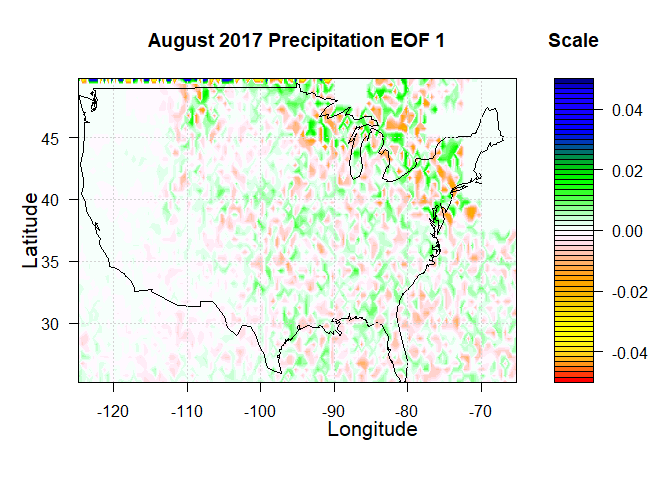<!-- --><!-- --><!-- --><!-- --><!-- -->

``` r
LAT=seq(25.25,by=.5,len=50)
LON=seq(-124.75,by=.5, len=120)
monID=format(ISOdate(2004,1:12,1),"%B")
for (m in 1:12){
    n=2
    mapMatrix = - matrix(dat3[,,70,m]/sqrt(cos(LAT*pi/180)),nrow=120)
    mapMatrix = pmax(pmin(mapMatrix,0.05),-0.05)
    rgb.palette=colorRampPalette(c('red','yellow','orange', 'white', 
                                   'green','blue','darkblue'),interpolate='spline')
    int=seq(-0.05,0.05,length.out=61)
    mapMatrix=mapMatrix[, seq(length(mapMatrix[1,]),1)]
    #jpeg(paste("EOF", n, "_prec_month", m, "2017.png"),
    #     width=1600, height=1000, res=300)
    filled.contour(LON, LAT, mapMatrix, color.palette=rgb.palette, levels=int,
                   plot.title=title(main=paste(monID[m],"Precipitation EOF",n),
                                    xlab="", ylab=""),
                   plot.axes={axis(1); axis(2);map('usa', add=TRUE);grid()},
                   key.title=title(main="Scale"))
    mtext("Longitude",side=1,line = 2,cex=1.3)
    mtext("Latitude",side=2,line = 2,cex=1.3)
    #dev.off()
}
```

<!-- --><!-- --><!-- --><!-- --><!-- --><!-- --><!-- --><!-- --><!-- --><!-- --><!-- --><!-- -->

``` r
#plot precentage eigenvalues and cumulatives
modeNo=1:70
for (m in 1:12) { 
   par(mar=c(4,5,2,4))
  #jpeg(paste("Eigenval_perc_", m, "_prec_month", m, ".png"),
  #      width=1200, height=1000, res=200)
  plot(modeNo, pEigenMat[,m],type="o", ylim=c(0,50),
       col="red", lwd=2.0, xlab="",ylab="", xaxt="n", yaxt="n")
  title(ylab="Percentage Variance [%]",col.lab="red",
        main = paste("Prec. 1948-2018 Covariance Eigenvalues for", monID[m], sep = " "),
        cex.lab=1.4)
  axis(1, cex.axis=1.4)
  axis(2, col.axis="red", cex.axis=1.4)
  legend(14,12, col=c("red"),lty=1,lwd=2.0,
         legend=c("Percentange Variance"),bty="n",
         text.font=2,cex=1.0, text.col="red")
  par(new=TRUE)
  plot(modeNo,pcEigenMat[,m], type="o",ylim=c(0,100),
       col="blue",lwd=2.0,axes=FALSE,xlab="",ylab="",xaxt="n", yaxt="n")
  axis(4, col.axis="blue", cex.axis=1.4)
  legend(14,70, col=c("blue"),lty=1,lwd=2.0,
         legend=c("Cumulative Percentage Variance [%]"),bty="n",
         text.font=2,cex=1.0, text.col="blue")
  mtext("Cumulative variance [%]",side=4,line=2.5, cex=1.4, col="blue")
  mtext("EOF Mode Number", side=1,line=2,cex=1.4)
  #dev.off()
}
```

<!-- --><!-- --><!-- --><!-- --><!-- --><!-- --><!-- --><!-- --><!-- --><!-- --><!-- --><!-- -->

``` r
# plotting them in the same plot
modeNo=1:70
par(mfrow = c(4, 3))  # 4 rows and 3 columns
for (m in 1:12) { 
  par(mar=c(4,4,2,4))
  plot(modeNo, pEigenMat[,m],type="o", ylim=c(0,50),
       xlab="", ylab="",
       main = paste("Eigenvalues for", monID[m], split = ""),
       col="red")
  mtext("EOF Mode Number",side=1, line = 2.0, cex=.8)
  mtext("PercentVar[%]",side=2, line = 2.0, cex=.6)
  legend(10,12, col=c("black"),lty=1,lwd=2.0,
         legend=c("PercentVar"),bty="n",
         text.font=1.0,cex=1.0, text.col="red")
  par(new=TRUE)
  plot(modeNo,pcEigenMat[,m], type="o",
       col="blue",lwd=1.5,axes=FALSE,xlab="",ylab="", ylim=c(0,100))
  legend(10,80, col=c("blue"),lty=1,lwd=2.0,
         legend=c("CumulativeVar"),bty="n",
         text.font=1.0,cex=1.0, text.col="blue")
  axis(4)
  mtext("Cum Var [%]",cex=0.6,side=4,line=2)
}
```

<!-- -->

``` r
# plotting the first 6 EOFs:
monID=format(ISOdate(2004,1:12,1),"%B")
for (m in 1:12) { 
  for (n in 1:1){
mapMatrix = - matrix(EOFar[m,,n]/sqrt(cos(climMAT[,1]*pi/180)),nrow=120)
mapMatrix = pmax(pmin(mapMatrix,0.05),-0.03)
rgb.palette=colorRampPalette(c('red','yellow','orange', 'white', 
                               'green','blue','darkblue'),interpolate='spline')
int=seq(-0.03,0.05,length.out=61)
mapMatrix=mapMatrix[, seq(length(mapMatrix[1,]),1)]
#jpeg(paste("EOF", n, "_prec_month", m, "2017.png"),
#         width=1600, height=1000, res=300)
filled.contour(LON, LAT, mapMatrix, color.palette=rgb.palette, levels=int,
               plot.title=title(main=paste(monID[m],"Precipitation EOF",n),
                                xlab="", ylab=""),
               plot.axes={axis(1); axis(2);map('usa', add=TRUE);grid()},
               key.title=title(main="Scale"))
mtext("Longitude",side=1,line = 2,cex=1.3)
mtext("Latitude",side=2,line = 2,cex=1.3)
#dev.off()
}
}
```

<!-- --><!-- --><!-- --><!-- --><!-- --><!-- --><!-- --><!-- --><!-- --><!-- --><!-- --><!-- -->

``` r
# do the same for SST anomaly
na2zero <- function(x) ifelse(is.na(x), 0, x)
##### sst variables 
zlev <- ncvar_get(nc_sst_orig, "zlev")
# East Longitude (deg)
X_sst <- ncvar_get(nc_sst_orig, "X")
print (dim(X_sst))
```

    ## [1] 84

``` r
# time from Jan. 1948 to Feb. 2018 
# 12*(2018-1948)+1(Jan 2018)+1(Feb 2018) = 842
time_sst <- ncvar_get(nc_sst_orig, "T")
print (dim(time_sst))
```

    ## [1] 842

``` r
# Latitude (deg)
Y_sst <- ncvar_get(nc_sst_orig, "Y")
print (dim(Y_sst))
```

    ## [1] 33

``` r
sst_anom <- ncvar_get(nc_sst_orig, "anom")
print (dim(sst_anom))
```

    ## [1]  84  33 842

``` r
# replace the NA with the average of existing data
mean_all_sst <- sum((na2zero(sst_anom)))/sum((!is.na(sst_anom)))
sst_anom[is.na(sst_anom)]<-0
```

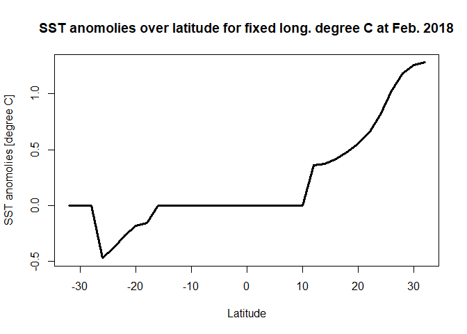<!-- --><!-- -->

``` r
# save Prec. file in .csv format
# with 844 columns, Lat, Long., each months(842)
SSTst=matrix(0,nrow=2772,ncol=842)
for (i in 1:842) {
  SSTst[,i]=as.vector(sst_anom[ , , i])
}
LAT_sst=rep(Y_sst, each=84)
LON_sst=rep(X_sst,33)
yr1=c(rep(1948:2017,each=12), rep(2018,2))
mon1=c(rep(1:12,70),1:2)
timehead=paste(yr1,"-",mon1)
colnames(SSTst)=timehead
SSTst2=cbind(LAT_sst,LON_sst,SSTst)
write.csv(SSTst2, file="sst_1948Jan18Feb.csv")
```

``` r
library(matrixStats)
climMAT_sst=matrix(0,nrow=2772, ncol=14)
climMAT_sst[,1:2]=SSTst2[,1:2]
sdMAT_sst=climMAT_sst
for(i in 1:12){
   if (i>2){
  mon=seq(2+i,by=12, len=70)
  monDat=SSTst2[,mon]
  climMAT_sst[,2+i]=rowMeans(monDat)
  sdMAT_sst[,2+i]<-rowSds(monDat)
   }
   else{
  mon=seq(2+i,by=12, len=71)
  monDat=SSTst2[,mon]
  climMAT_sst[,2+i]=rowMeans(monDat)
  sdMAT_sst[,2+i]<-rowSds(monDat)
   }
}
```

``` r
# plotting SST for each month
library(maps)
#LAT=seq(-73.75,by=2.5,len=60)
LAT = Y_sst
LON = X_sst
#LON=seq(1.25,by=2.5, len=144)
monID=format(ISOdate(2004,1:12,1),"%B")
for (m in 1:12){
mapMatrix_sst=matrix(climMAT_sst[,2+m],nrow=84)
#mapMatrix_sst=pmin(mapMatrix_sst,10)
int=seq(-0.5,0.5,length.out=11)
rgb.palette=colorRampPalette(c('skyblue',  'green', 'blue', 'yellow', 'orange', 'pink','red', 
                               'maroon', 'purple', 'black'),interpolate='spline')
#jpeg(paste ("sst_meanpermonth_",m,".png"),width=1600, height=1000, res=300)
filled.contour(LON, LAT, mapMatrix_sst, color.palette=rgb.palette, levels=int,
               plot.title=title(main=paste(monID[m],"1948-2018 SST anomolies"),
                                xlab="Longitude", ylab="Latitude"),
               plot.axes={axis(1); axis(2);map('world2', add=TRUE);grid()},
               key.title=title(main="deg. C"))
#dev.off()
}
```

<!-- --><!-- --><!-- --><!-- --><!-- --><!-- --><!-- --><!-- --><!-- --><!-- --><!-- --><!-- -->

``` r
#Plot standard deviation 
library(maps)
LAT = Y_sst
LON = X_sst
monID=format(ISOdate(2004,1:12,1),"%B")
for (m in 1:12){
mapMatrix_sst=matrix(sdMAT_sst[,2+m],nrow=84)
#mapMatrix_sst=pmin(mapMatrix_sst,5) #Compress the values >8 to 8
int=seq(0,1.3,length.out=11)
rgb.palette=colorRampPalette(c('skyblue',  'green', 'blue', 'yellow', 'orange', 'pink', 'red', 'maroon', 'purple', 'black'),interpolate='spline')
#jpeg(paste ("sst_SDpermonth_",m,".png"),width=1600, height=1000, res=300)
filled.contour(LON, LAT, mapMatrix_sst, color.palette=rgb.palette, levels=int,
               plot.title=title(main=paste(monID[m], "1948-2018 SD(SST anomolies)"), xlab="Longitude", ylab="Latitude"),
               plot.axes={axis(1); axis(2);map('world2', add=TRUE);grid()},
               key.title=title(main="deg. C"))
#dev.off()
}
```

<!-- --><!-- --><!-- --><!-- -->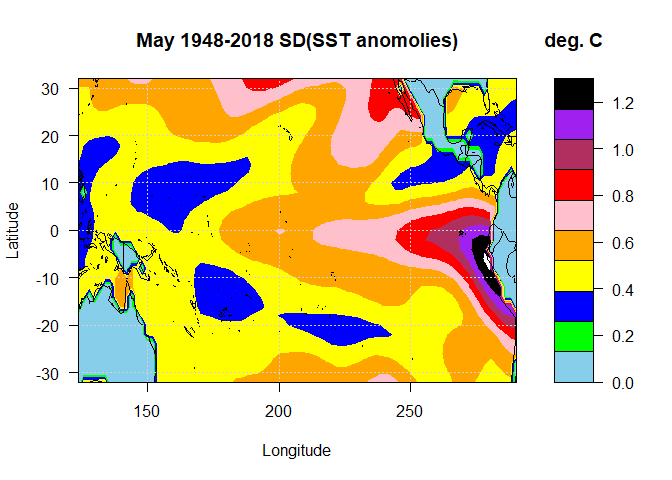<!-- --><!-- --><!-- --><!-- --><!-- --><!-- --><!-- --><!-- -->

``` r
# the standardized matrix, anomprec = prec-mean(month)
# area weighted anomaly matrix, anomW
anomsst=matrix(0, nrow=2772, ncol=844)
anomsst[,1:2]=climMAT_sst[,1:2]
colnames(anomsst)<-colnames(SSTst2)
anomAW=anomsst
colnames(anomAW)<-colnames(SSTst2)
for (m in 1:12){
  monC=seq(2+m,844, by=12)
  anomsst[,monC]=SSTst2[,monC]-climMAT_sst[,2+m]
}
anomAW[,3:844]=sqrt(cos(anomsst[,1]*pi/180))*anomsst[,3:844]
```

``` r
# EOFs of standardizd anomalies from 1948 - 2017 (Jan. Feb. 2018 not considered)
EOFar=array(0, dim=c(12,2772,70)) #EOFar[month,gridID,modeNo]
PCar=array(0, dim=c(12,70,70))
EigenMat=matrix(0, nrow=70, ncol=12)
for (m in 1:12){
      monD=seq(2+m, by=12, 842)
  svd8110=svd(anomAW[,monD]) #execute SVD
  EOFar[m,,]=svd8110$u
  colnames(EOFar[m,,])<-paste(rep("E",70),sep="",1:70)
  PCar[m,,]=svd8110$v
  colnames(PCar[m,,])<-paste(rep("PC",70),sep="",1:70)
  EigenMat[,m]=(svd8110$d)^2/30
}
colnames(EigenMat)<-monID
cEigenMat=pEigenMat=pcEigenMat=EigenMat
for(m in 1:12){
  cEigenMat[,m]=cumsum(EigenMat[,m])
  pEigenMat=100*t(t(EigenMat)/colSums(EigenMat))
  pcEigenMat=100*t(t(cEigenMat)/colSums(EigenMat))
}
```

``` r
filename="EOF_sst1948_2018.nc"
library(ncdf4)
xvals=LAT
yvals=LON 
nx=length(xvals)
ny=length(yvals)
nmode=70
nmonth=12
lon=ncdim_def("Longitude", "degrees increase", xvals)
lat=ncdim_def("Latitude", "degrees increase", yvals)
mode2=ncdim_def("Mode","numbers", 1:nmode)
time2=ncdim_def("Time","months", 1:nmonth)
var_eof=ncvar_def("EOFvalues", "dimensionless", 
                     list(lon, lat, mode2, time2), 
                     longname="EOF data from sst data 1948-2017: 
                               70modes 12months") 
ncnew=nc_create(filename, list(var_eof))
print(paste("The file has", ncnew$ndim,"dimensions"))
```

    ## [1] "The file has 4 dimensions"

``` r
#Read the .nc file
nc=ncdf4::nc_open("EOF_sst1948_2018.nc")
dat3<- ncvar_get(nc, "EOFvalues")
```

``` r
LAT=seq(-32,by=2,len=33)
LON=seq(124,by=2, len=84)
monID=format(ISOdate(2004,1:12,1),"%B")
for (m in 1:12){
    n=1
    mapMatrix_sst = - matrix(dat3[,,1,m]/sqrt(cos(LAT*pi/180)),nrow=84)
    mapMatrix_sst = pmax(pmin(mapMatrix_sst,0.03),-0.03)
    rgb.palette=colorRampPalette(c('red','yellow','orange', 'white', 
                                   'green','blue','darkblue'),interpolate='spline')
    int=seq(-0.03,0.03,length.out=61)
    mapMatrix_sst=mapMatrix_sst[, seq(length(mapMatrix_sst[1,]),1)]
    #jpeg(paste("EOF", n, "_sst_month", m, "2017.png"),
    #            width=1600, height=1000, res=300)
    filled.contour(LON, LAT, mapMatrix_sst, color.palette=rgb.palette, levels=int,
                   plot.title=title(main=paste(monID[m],"SST EOF",n),
                                    xlab="", ylab=""),
                   plot.axes={axis(1); axis(2);map('world2', add=TRUE);grid()},
                   key.title=title(main="Scale"))
    mtext("Longitude",side=1,line = 2,cex=1.3)
    mtext("Latitude",side=2,line = 2,cex=1.3)
    #dev.off()
}
```

<!-- --><!-- --><!-- --><!-- -->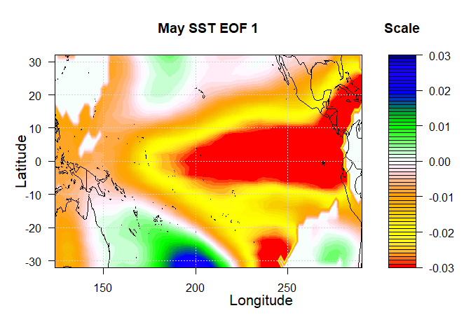<!-- --><!-- --><!-- --><!-- --><!-- --><!-- --><!-- --><!-- -->

``` r
# second EOF
LAT=seq(-32,by=2,len=33)
LON=seq(124,by=2, len=84)
monID=format(ISOdate(2004,1:12,1),"%B")
for (m in 1:12){
    n=2
    mapMatrix_sst = - matrix(dat3[,,2,m]/sqrt(cos(LAT*pi/180)),nrow=84)
    mapMatrix_sst = pmax(pmin(mapMatrix_sst,0.03),-0.05)
    rgb.palette=colorRampPalette(c('red','yellow','orange', 'white', 
                                   'green','blue','darkblue'),interpolate='spline')
    int=seq(-0.05,0.03,length.out=61)
    mapMatrix_sst=mapMatrix_sst[, seq(length(mapMatrix_sst[1,]),1)]
    #jpeg(paste("EOF", n, "_sst_month", m, "2017.png"),
    #     width=1600, height=1000, res=300)
    filled.contour(LON, LAT, mapMatrix_sst, color.palette=rgb.palette, levels=int,
                   plot.title=title(main=paste(monID[m],"SST EOF",n),
                                    xlab="", ylab=""),
                   plot.axes={axis(1); axis(2);map('world2', add=TRUE);grid()},
                   key.title=title(main="Scale"))
    mtext("Longitude",side=1,line = 2,cex=1.3)
    mtext("Latitude",side=2,line = 2,cex=1.3)
    #dev.off()
}
```

<!-- --><!-- --><!-- --><!-- --><!-- --><!-- --><!-- --><!-- --><!-- --><!-- --><!-- --><!-- -->

``` r
#plot percentage eigenvalues and cumulative
modeNo=1:70
for (m in 1:12) { 
   par(mar=c(4,5,2,4))
    #jpeg(paste("Eigenval_perc_", m, "_sst_month", m, ".png"),
    #    width=1200, height=1000, res=200)
  plot(modeNo, pEigenMat[,m],type="o", ylim=c(0,70),
       col="red", lwd=2.0, xlab="",ylab="", xaxt="n", yaxt="n")
  title(ylab="Percentage Variance [%]",col.lab="red",
        main = paste("SST 1948-2018 Covariance Eigenvalues for", monID[m], sep = " "),
        cex.lab=1.4)
  axis(1, cex.axis=1.4)
  axis(2, col.axis="red", cex.axis=1.4)
  legend(14,12, col=c("red"),lty=1,lwd=2.0,
         legend=c("Percentange Variance"),bty="n",
         text.font=2,cex=1.0, text.col="red")
  par(new=TRUE)
  plot(modeNo,pcEigenMat[,m], type="o",ylim=c(0,100),
       col="blue",lwd=2.0,axes=FALSE,xlab="",ylab="",xaxt="n", yaxt="n")
  axis(4, col.axis="blue", cex.axis=1.4)
  legend(14,70, col=c("blue"),lty=1,lwd=2.0,
         legend=c("Cumulative Percentage Variance [%]"),bty="n",
         text.font=2,cex=1.0, text.col="blue")
  mtext("Cumulative variance [%]",side=4,line=2.5, cex=1.4, col="blue")
  mtext("EOF Mode Number", side=1,line=2,cex=1.4)
  #dev.off()
}
```

<!-- --><!-- --><!-- --><!-- --><!-- --><!-- --><!-- --><!-- --><!-- --><!-- --><!-- --><!-- -->

``` r
# plotting them in the same plot
modeNo=1:70
par(mfrow = c(4, 3))  # 4 rows and 3 columns
for (m in 1:12) { 
  par(mar=c(4,4,2,4))
  plot(modeNo, pEigenMat[,m],type="o", ylim=c(0,60),
       xlab="", ylab="",
       main = paste("Eigenvalues for", monID[m], split = ""),
       col="red")
  mtext("EOF Mode Number",side=1, line = 2.0, cex=.8)
  mtext("PercentVar[%]",side=2, line = 2.0, cex=.6)
  legend(10,12, col=c("black"),lty=1,lwd=2.0,
         legend=c("PercentVar"),bty="n",
         text.font=1.0,cex=1.0, text.col="red")
  par(new=TRUE)
  plot(modeNo,pcEigenMat[,m], type="o",
       col="blue",lwd=1.5,axes=FALSE,xlab="",ylab="", ylim=c(0,100))
  legend(10,80, col=c("blue"),lty=1,lwd=2.0,
         legend=c("CumulativeVar"),bty="n",
         text.font=1.0,cex=1.0, text.col="blue")
  axis(4)
  mtext("Cum Var [%]",cex=0.6,side=4,line=2)
}
```

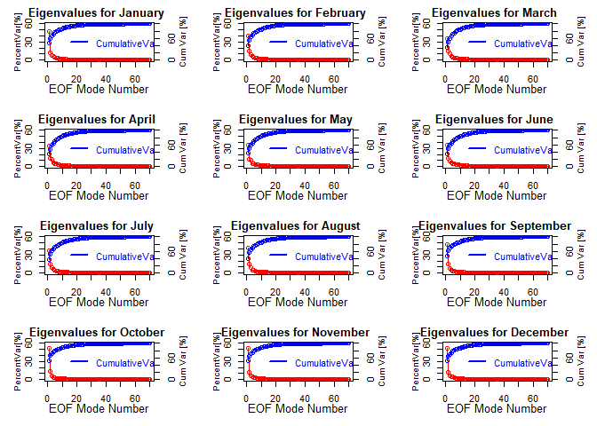<!-- -->

``` r
LAT=seq(-32,by=2,len=33)
LON=seq(124,by=2, len=84)
monID=format(ISOdate(2004,1:12,1),"%B")
for (m in 1:12) { 
  for (n in 1:6){
mapMatrix_sst = - matrix(EOFar[m,,n]/sqrt(cos(climMAT_sst[,1]*pi/180)),nrow=84)
print (min(mapMatrix_sst))
print (max(mapMatrix_sst))
#mapMatrix_sst = pmax(pmin(mapMatrix_sst,0.03),-0.03)
rgb.palette=colorRampPalette(c('red','yellow','orange', 'white', 
                               'green','blue','darkblue'),interpolate='spline')
int=seq(-0.03,0.03,length.out=61)
mapMatrix_sst=mapMatrix_sst[, seq(length(mapMatrix_sst[1,]),1)]
#jpeg(paste("EOF", n, "_sst_month", m, "2017.png"),
#         width=1600, height=1000, res=300)
filled.contour(LON, LAT, mapMatrix_sst, color.palette=rgb.palette, levels=int,
               plot.title=title(main=paste(monID[m],"Precipitation EOF",n),
                                xlab="", ylab=""),
               plot.axes={axis(1); axis(2);map('usa', add=TRUE);grid()},
               key.title=title(main="Scale"))
mtext("Longitude",side=1,line = 2,cex=1.3)
mtext("Latitude",side=2,line = 2,cex=1.3)
#dev.off()
}
}
```

    ## [1] -0.05480877
    ## [1] 0.02107931

<!-- -->

    ## [1] -0.02654406
    ## [1] 0.04371254

<!-- -->

    ## [1] -0.062735
    ## [1] 0.04029013

<!-- -->

    ## [1] -0.06828844
    ## [1] 0.03398899

<!-- -->

    ## [1] -0.05934317
    ## [1] 0.05404008

<!-- -->

    ## [1] -0.05222313
    ## [1] 0.06221468

<!-- -->

    ## [1] -0.05277617
    ## [1] 0.02976673

<!-- -->

    ## [1] -0.02474259
    ## [1] 0.04824452

<!-- -->

    ## [1] -0.05146243
    ## [1] 0.03552353

<!-- -->

    ## [1] -0.06685825
    ## [1] 0.04460857

<!-- -->

    ## [1] -0.05875523
    ## [1] 0.05643672

<!-- -->

    ## [1] -0.04917664
    ## [1] 0.05970685

<!-- -->

    ## [1] -0.0513139
    ## [1] 0.03306678

<!-- -->

    ## [1] -0.05091157
    ## [1] 0.02696342

<!-- -->

    ## [1] -0.04971664
    ## [1] 0.05357488

<!-- -->

    ## [1] -0.05224272
    ## [1] 0.05924777

<!-- -->

    ## [1] -0.05763056
    ## [1] 0.05652067

<!-- -->

    ## [1] -0.0631682
    ## [1] 0.0431487

<!-- -->

    ## [1] -0.05815225
    ## [1] 0.02455778

<!-- -->

    ## [1] -0.05004593
    ## [1] 0.02168326

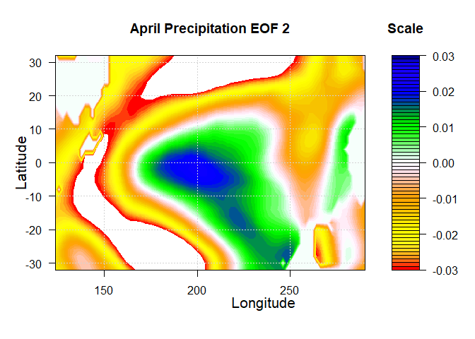<!-- -->

    ## [1] -0.08087977
    ## [1] 0.04868631

<!-- -->

    ## [1] -0.04771475
    ## [1] 0.06549391

<!-- -->

    ## [1] -0.04615602
    ## [1] 0.05033137

<!-- -->

    ## [1] -0.0608794
    ## [1] 0.05222618

<!-- -->

    ## [1] -0.06833005
    ## [1] 0.02825167

<!-- -->

    ## [1] -0.04113029
    ## [1] 0.03794255

<!-- -->

    ## [1] -0.06453735
    ## [1] 0.05544086

<!-- -->

    ## [1] -0.05093872
    ## [1] 0.05126749

<!-- -->

    ## [1] -0.0535875
    ## [1] 0.05848086

<!-- -->

    ## [1] -0.05281816
    ## [1] 0.05951586

<!-- -->

    ## [1] -0.07175349
    ## [1] 0.02026435

<!-- -->

    ## [1] -0.04789971
    ## [1] 0.04358199

<!-- -->

    ## [1] -0.05247618
    ## [1] 0.05089591

<!-- -->

    ## [1] -0.06906841
    ## [1] 0.06332811

<!-- -->

    ## [1] -0.06379058
    ## [1] 0.07654678

<!-- -->

    ## [1] -0.05081567
    ## [1] 0.05370917

<!-- -->

    ## [1] -0.06845558
    ## [1] 0.01098529

<!-- -->

    ## [1] -0.04404594
    ## [1] 0.04350324

<!-- -->

    ## [1] -0.05209245
    ## [1] 0.04451555

<!-- -->

    ## [1] -0.07111311
    ## [1] 0.04766415

<!-- -->

    ## [1] -0.04123419
    ## [1] 0.07617216

<!-- -->

    ## [1] -0.03756739
    ## [1] 0.06674233

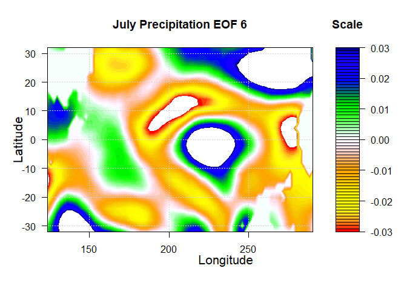<!-- -->

    ## [1] -0.0563525
    ## [1] 0.01160025

<!-- -->

    ## [1] -0.03234151
    ## [1] 0.03710377

<!-- -->

    ## [1] -0.05182796
    ## [1] 0.03847126

<!-- -->

    ## [1] -0.03781899
    ## [1] 0.07694411

<!-- -->

    ## [1] -0.03811931
    ## [1] 0.08645135

<!-- -->

    ## [1] -0.05696478
    ## [1] 0.04996583

<!-- -->

    ## [1] -0.05118413
    ## [1] 0.01577532

<!-- -->

    ## [1] -0.04197894
    ## [1] 0.01941326

<!-- -->

    ## [1] -0.0555725
    ## [1] 0.04529853

<!-- -->

    ## [1] -0.04436334
    ## [1] 0.08299024

<!-- -->

    ## [1] -0.04908761
    ## [1] 0.05677326

<!-- -->

    ## [1] -0.08382031
    ## [1] 0.04738243

<!-- -->

    ## [1] -0.05097251
    ## [1] 0.01944234

<!-- -->

    ## [1] -0.04553297
    ## [1] 0.01589417

<!-- -->

    ## [1] -0.05180628
    ## [1] 0.04378561

<!-- -->

    ## [1] -0.05009769
    ## [1] 0.08759514

<!-- -->

    ## [1] -0.05438565
    ## [1] 0.05747813

<!-- -->

    ## [1] -0.0698094
    ## [1] 0.0529571

<!-- -->

    ## [1] -0.05374536
    ## [1] 0.01742002

<!-- -->

    ## [1] -0.02208248
    ## [1] 0.04814717

<!-- -->

    ## [1] -0.0562153
    ## [1] 0.06619705

<!-- -->

    ## [1] -0.06566237
    ## [1] 0.05112298

<!-- -->

    ## [1] -0.07880004
    ## [1] 0.06048203

<!-- -->

    ## [1] -0.07580213
    ## [1] 0.04762715

<!-- -->

    ## [1] -0.05456178
    ## [1] 0.01408804

<!-- -->

    ## [1] -0.04766424
    ## [1] 0.02286309

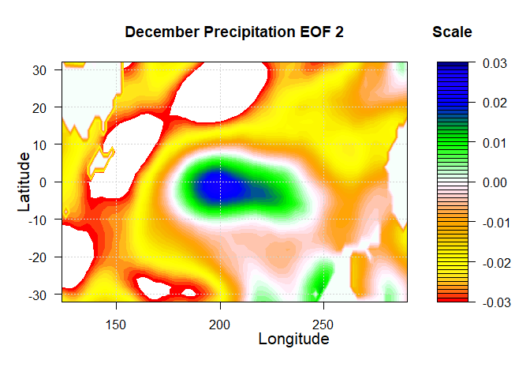<!-- -->

    ## [1] -0.0467152
    ## [1] 0.05068961

<!-- -->

    ## [1] -0.06373101
    ## [1] 0.03969281

<!-- -->

    ## [1] -0.07361081
    ## [1] 0.05290926

<!-- -->

    ## [1] -0.07198344
    ## [1] 0.05876007

<!-- -->

## Part2(b): dimension reduction method 2

``` r
sst_anom <- ncvar_get(nc_sst_orig, "anom")
X_sst <- ncvar_get(nc_sst_orig, "X")
time_sst <- ncvar_get(nc_sst_orig, "T")
Y_sst <- ncvar_get(nc_sst_orig, "Y")

s1 <- which(is.na(sst_anom[,,1]))
s2 <- which(!is.na(sst_anom[,,1]))
sst <- matrix(0, nrow = dim(sst_anom)[3], ncol = length(s2))
for(i in 1:dim(sst_anom)[3])
  sst[i,] <- sst_anom[,,i][-s1]
pca1 <- svd(sst)
plot(pca1$d^2/sum(pca1$d^2), xlim = c(0, 10), type = "b", 
     pch = 15, xlab = "Eigenvalue", ylab = "variance",main = "SST", col="red")
```

<!-- -->

``` r
##plotting pCs
loc1 <- as.matrix(expand.grid(x = X_sst, Y_SST = Y_sst))[s2,]
coltab <- colorRampPalette(brewer.pal(9,"BrBG"))(2048)
# plot the PCs
par(mar = c(5,5,3,3), oma=c(1,1,1,1))
quilt.plot(loc1, pca1$v[,4], nx = length(Y_sst), 
           ny = length(Y_sst), xlab = "longitude",
           ylab = "latitude", 
           main = "4th PC for SST", col = coltab,
           cex.lab = 1, cex.axis = 1, cex.main = 1,
           legend.cex = 20)
```

<!-- -->

``` r
prec <- ncvar_get(nc_prec_orig, "rain")
X_prec <- ncvar_get(nc_prec_orig, "X")
time_prec <- ncvar_get(nc_prec_orig, "T")
Y_prec <- ncvar_get(nc_prec_orig, "Y")

prec_s1 <- which(is.na(prec[,,1]))
prec_s2 <- which(!is.na(prec[,,1]))
prec_sst <- matrix(0, nrow = dim(prec)[3], ncol = length(prec_s2))
for(i in 1:dim(prec)[3])
   prec_sst[i,] <- prec[,,i][-prec_s1]

prec_pca <- svd(prec_sst)
sv <- svd(prec_sst)
plot(prec_pca$d^2/sum(prec_pca$d^2), xlim = c(0, 10), type = "b", 
     pch = 15, xlab = "Eigenvalue", ylab = "variance", main = "Precipitation", col="red")
```

<!-- -->

``` r
loc2 <- as.matrix(expand.grid(x = X_prec, Y_SST = Y_prec))[prec_s2,]

par(mfrow = c(2,2))

quilt.plot(loc2, prec_pca$v[,4], nx = length(X_prec), 
           ny = length(Y_prec), xlab = "longitude",
           ylab = "latitude", 
           main = "4th PC for Precip", col = coltab,
           cex.lab = 1, cex.axis = 1, cex.main = 1,
           legend.cex = 20)
```

<!-- -->

# Part3: Clustering

## Part3(a): Clustering for sst data

``` r
#Determine number of clusters
par(mfrow=c(1,1))
wss <- (nrow(sst)-1)*sum(apply(sst,2,var))
for (i in 2:15) wss[i] <- sum(kmeans(sst,
                                     centers=i)$withinss)
plot(1:15, wss, type="b", xlab="Number of Clusters",
     ylab="Within groups sum of squares", cex.lab = 1, cex.axis = 1)
```

<!-- -->

``` r
##extracting first 4 PCs (clustering)
#selected k =6 or k=4
x <- t(pca1$d * t(pca1$u))
x1 <- x[,1:4]
km.out <- kmeans(x1, 4, nstart = 20)
km.out$cluster
```

    ##   [1] 3 4 3 4 4 3 3 3 3 3 3 3 3 3 3 3 3 3 3 3 3 3 3 3 3 3 3 3 3 3 3 3 3 3 3 3 3
    ##  [38] 3 3 4 4 4 1 4 4 4 4 4 4 4 4 4 4 4 4 4 4 4 3 4 4 4 4 4 4 4 4 4 4 4 4 4 4 4
    ##  [75] 4 3 3 3 3 3 3 3 3 3 3 3 3 3 3 3 3 3 3 3 3 3 3 3 3 3 3 3 3 3 3 3 3 3 3 4 4
    ## [112] 4 1 1 1 1 4 4 1 1 1 1 1 4 4 4 4 4 4 4 4 4 4 4 4 4 4 4 4 4 4 4 4 4 4 4 4 4
    ## [149] 4 4 4 4 4 4 3 4 4 4 4 4 4 4 3 3 3 3 3 3 3 3 3 3 3 3 3 4 3 3 3 3 3 4 4 4 4
    ## [186] 4 4 4 4 4 4 4 4 4 3 3 3 3 3 3 3 3 3 3 3 4 4 4 4 4 4 1 4 1 1 1 4 4 4 4 4 4
    ## [223] 4 4 4 4 4 4 3 3 3 3 4 4 3 3 3 3 3 3 3 3 3 3 3 4 4 4 4 4 4 4 4 4 4 4 4 4 4
    ## [260] 4 4 4 4 4 4 4 4 4 3 3 3 3 3 3 3 3 3 3 3 3 3 3 3 3 3 3 3 3 3 4 4 4 4 4 1 1
    ## [297] 1 1 1 1 1 1 4 3 3 3 3 3 3 3 3 3 3 3 3 3 3 3 3 3 3 3 3 3 3 3 3 3 3 3 3 3 3
    ## [334] 3 3 3 3 3 3 3 3 4 4 4 4 4 4 4 1 4 4 4 4 4 4 4 4 4 4 4 4 4 4 4 4 4 4 4 3 4
    ## [371] 4 4 4 4 4 4 4 4 4 4 4 4 4 4 4 4 4 4 4 4 4 4 4 4 4 4 4 4 4 4 4 2 4 4 4 4 4
    ## [408] 4 2 4 4 4 4 4 4 1 1 1 1 1 1 1 1 1 1 1 1 1 4 2 2 4 4 2 4 4 2 4 4 4 4 4 3 3
    ## [445] 3 3 3 3 3 4 4 4 4 4 4 4 4 4 4 4 4 4 4 4 4 4 1 1 1 1 1 1 1 1 1 1 1 1 1 1 1
    ## [482] 2 2 2 2 3 3 3 3 3 3 3 3 3 3 2 2 2 2 4 2 4 4 4 4 4 4 4 4 4 4 4 4 4 4 4 4 4
    ## [519] 4 2 4 1 1 4 4 1 1 1 1 1 1 1 1 1 4 4 4 4 4 4 4 1 1 1 1 1 4 4 4 4 4 4 4 4 4
    ## [556] 4 4 4 4 4 4 1 1 1 1 4 4 4 4 4 2 2 2 2 2 2 2 2 2 2 2 2 2 2 2 2 4 2 4 2 2 4
    ## [593] 1 1 1 1 1 1 1 1 1 1 1 1 1 1 2 2 2 2 2 2 3 3 2 3 3 3 3 3 3 3 3 3 3 3 2 2 2
    ## [630] 2 4 2 2 2 2 2 2 2 2 2 2 2 2 2 2 2 2 2 2 2 2 2 2 2 2 2 2 1 1 1 2 4 2 2 2 2
    ## [667] 2 2 2 2 2 2 2 2 2 2 2 2 2 2 2 2 1 2 2 2 4 2 2 2 2 2 2 2 2 2 2 2 2 2 2 2 2
    ## [704] 1 1 1 1 1 1 2 2 2 2 2 2 2 2 3 3 3 3 3 2 2 2 2 2 2 2 2 2 2 2 2 2 2 2 2 2 2
    ## [741] 2 1 1 1 1 1 2 2 2 2 2 3 3 3 3 3 3 3 3 2 2 2 2 3 3 3 3 3 2 2 2 2 2 2 2 4 2
    ## [778] 2 2 2 2 2 2 2 2 2 2 2 2 2 2 2 2 2 2 2 2 2 2 2 2 2 1 2 2 2 2 1 1 1 1 1 1 1
    ## [815] 1 1 1 1 1 1 2 2 2 2 2 2 2 2 2 2 2 2 2 2 2 2 2 2 2 2 2 2

``` r
par (mfrow = c(1, 3))
plot (x1, col = (km.out$cluster + 1),
        main = "K-Means Clustering (sst) with K = 4",
        xlab = "", ylab = "", pch = 20, cex = 1,cex.main = 0.75)

km.out1 <- kmeans(x1, 6, nstart = 20)
km.out$cluster
```

    ##   [1] 3 4 3 4 4 3 3 3 3 3 3 3 3 3 3 3 3 3 3 3 3 3 3 3 3 3 3 3 3 3 3 3 3 3 3 3 3
    ##  [38] 3 3 4 4 4 1 4 4 4 4 4 4 4 4 4 4 4 4 4 4 4 3 4 4 4 4 4 4 4 4 4 4 4 4 4 4 4
    ##  [75] 4 3 3 3 3 3 3 3 3 3 3 3 3 3 3 3 3 3 3 3 3 3 3 3 3 3 3 3 3 3 3 3 3 3 3 4 4
    ## [112] 4 1 1 1 1 4 4 1 1 1 1 1 4 4 4 4 4 4 4 4 4 4 4 4 4 4 4 4 4 4 4 4 4 4 4 4 4
    ## [149] 4 4 4 4 4 4 3 4 4 4 4 4 4 4 3 3 3 3 3 3 3 3 3 3 3 3 3 4 3 3 3 3 3 4 4 4 4
    ## [186] 4 4 4 4 4 4 4 4 4 3 3 3 3 3 3 3 3 3 3 3 4 4 4 4 4 4 1 4 1 1 1 4 4 4 4 4 4
    ## [223] 4 4 4 4 4 4 3 3 3 3 4 4 3 3 3 3 3 3 3 3 3 3 3 4 4 4 4 4 4 4 4 4 4 4 4 4 4
    ## [260] 4 4 4 4 4 4 4 4 4 3 3 3 3 3 3 3 3 3 3 3 3 3 3 3 3 3 3 3 3 3 4 4 4 4 4 1 1
    ## [297] 1 1 1 1 1 1 4 3 3 3 3 3 3 3 3 3 3 3 3 3 3 3 3 3 3 3 3 3 3 3 3 3 3 3 3 3 3
    ## [334] 3 3 3 3 3 3 3 3 4 4 4 4 4 4 4 1 4 4 4 4 4 4 4 4 4 4 4 4 4 4 4 4 4 4 4 3 4
    ## [371] 4 4 4 4 4 4 4 4 4 4 4 4 4 4 4 4 4 4 4 4 4 4 4 4 4 4 4 4 4 4 4 2 4 4 4 4 4
    ## [408] 4 2 4 4 4 4 4 4 1 1 1 1 1 1 1 1 1 1 1 1 1 4 2 2 4 4 2 4 4 2 4 4 4 4 4 3 3
    ## [445] 3 3 3 3 3 4 4 4 4 4 4 4 4 4 4 4 4 4 4 4 4 4 1 1 1 1 1 1 1 1 1 1 1 1 1 1 1
    ## [482] 2 2 2 2 3 3 3 3 3 3 3 3 3 3 2 2 2 2 4 2 4 4 4 4 4 4 4 4 4 4 4 4 4 4 4 4 4
    ## [519] 4 2 4 1 1 4 4 1 1 1 1 1 1 1 1 1 4 4 4 4 4 4 4 1 1 1 1 1 4 4 4 4 4 4 4 4 4
    ## [556] 4 4 4 4 4 4 1 1 1 1 4 4 4 4 4 2 2 2 2 2 2 2 2 2 2 2 2 2 2 2 2 4 2 4 2 2 4
    ## [593] 1 1 1 1 1 1 1 1 1 1 1 1 1 1 2 2 2 2 2 2 3 3 2 3 3 3 3 3 3 3 3 3 3 3 2 2 2
    ## [630] 2 4 2 2 2 2 2 2 2 2 2 2 2 2 2 2 2 2 2 2 2 2 2 2 2 2 2 2 1 1 1 2 4 2 2 2 2
    ## [667] 2 2 2 2 2 2 2 2 2 2 2 2 2 2 2 2 1 2 2 2 4 2 2 2 2 2 2 2 2 2 2 2 2 2 2 2 2
    ## [704] 1 1 1 1 1 1 2 2 2 2 2 2 2 2 3 3 3 3 3 2 2 2 2 2 2 2 2 2 2 2 2 2 2 2 2 2 2
    ## [741] 2 1 1 1 1 1 2 2 2 2 2 3 3 3 3 3 3 3 3 2 2 2 2 3 3 3 3 3 2 2 2 2 2 2 2 4 2
    ## [778] 2 2 2 2 2 2 2 2 2 2 2 2 2 2 2 2 2 2 2 2 2 2 2 2 2 1 2 2 2 2 1 1 1 1 1 1 1
    ## [815] 1 1 1 1 1 1 2 2 2 2 2 2 2 2 2 2 2 2 2 2 2 2 2 2 2 2 2 2

``` r
par (mfrow = c(1, 2))
```

<!-- -->

``` r
plot (x1, col = (km.out1$cluster + 1),
      main = "K-Means Clustering (sst) with K = 6",
      xlab = "", ylab = "", pch = 20, cex = 1,cex.main = 0.75)


km.out2 <- kmeans(x1, 2, nstart = 20)
km.out$cluster
```

    ##   [1] 3 4 3 4 4 3 3 3 3 3 3 3 3 3 3 3 3 3 3 3 3 3 3 3 3 3 3 3 3 3 3 3 3 3 3 3 3
    ##  [38] 3 3 4 4 4 1 4 4 4 4 4 4 4 4 4 4 4 4 4 4 4 3 4 4 4 4 4 4 4 4 4 4 4 4 4 4 4
    ##  [75] 4 3 3 3 3 3 3 3 3 3 3 3 3 3 3 3 3 3 3 3 3 3 3 3 3 3 3 3 3 3 3 3 3 3 3 4 4
    ## [112] 4 1 1 1 1 4 4 1 1 1 1 1 4 4 4 4 4 4 4 4 4 4 4 4 4 4 4 4 4 4 4 4 4 4 4 4 4
    ## [149] 4 4 4 4 4 4 3 4 4 4 4 4 4 4 3 3 3 3 3 3 3 3 3 3 3 3 3 4 3 3 3 3 3 4 4 4 4
    ## [186] 4 4 4 4 4 4 4 4 4 3 3 3 3 3 3 3 3 3 3 3 4 4 4 4 4 4 1 4 1 1 1 4 4 4 4 4 4
    ## [223] 4 4 4 4 4 4 3 3 3 3 4 4 3 3 3 3 3 3 3 3 3 3 3 4 4 4 4 4 4 4 4 4 4 4 4 4 4
    ## [260] 4 4 4 4 4 4 4 4 4 3 3 3 3 3 3 3 3 3 3 3 3 3 3 3 3 3 3 3 3 3 4 4 4 4 4 1 1
    ## [297] 1 1 1 1 1 1 4 3 3 3 3 3 3 3 3 3 3 3 3 3 3 3 3 3 3 3 3 3 3 3 3 3 3 3 3 3 3
    ## [334] 3 3 3 3 3 3 3 3 4 4 4 4 4 4 4 1 4 4 4 4 4 4 4 4 4 4 4 4 4 4 4 4 4 4 4 3 4
    ## [371] 4 4 4 4 4 4 4 4 4 4 4 4 4 4 4 4 4 4 4 4 4 4 4 4 4 4 4 4 4 4 4 2 4 4 4 4 4
    ## [408] 4 2 4 4 4 4 4 4 1 1 1 1 1 1 1 1 1 1 1 1 1 4 2 2 4 4 2 4 4 2 4 4 4 4 4 3 3
    ## [445] 3 3 3 3 3 4 4 4 4 4 4 4 4 4 4 4 4 4 4 4 4 4 1 1 1 1 1 1 1 1 1 1 1 1 1 1 1
    ## [482] 2 2 2 2 3 3 3 3 3 3 3 3 3 3 2 2 2 2 4 2 4 4 4 4 4 4 4 4 4 4 4 4 4 4 4 4 4
    ## [519] 4 2 4 1 1 4 4 1 1 1 1 1 1 1 1 1 4 4 4 4 4 4 4 1 1 1 1 1 4 4 4 4 4 4 4 4 4
    ## [556] 4 4 4 4 4 4 1 1 1 1 4 4 4 4 4 2 2 2 2 2 2 2 2 2 2 2 2 2 2 2 2 4 2 4 2 2 4
    ## [593] 1 1 1 1 1 1 1 1 1 1 1 1 1 1 2 2 2 2 2 2 3 3 2 3 3 3 3 3 3 3 3 3 3 3 2 2 2
    ## [630] 2 4 2 2 2 2 2 2 2 2 2 2 2 2 2 2 2 2 2 2 2 2 2 2 2 2 2 2 1 1 1 2 4 2 2 2 2
    ## [667] 2 2 2 2 2 2 2 2 2 2 2 2 2 2 2 2 1 2 2 2 4 2 2 2 2 2 2 2 2 2 2 2 2 2 2 2 2
    ## [704] 1 1 1 1 1 1 2 2 2 2 2 2 2 2 3 3 3 3 3 2 2 2 2 2 2 2 2 2 2 2 2 2 2 2 2 2 2
    ## [741] 2 1 1 1 1 1 2 2 2 2 2 3 3 3 3 3 3 3 3 2 2 2 2 3 3 3 3 3 2 2 2 2 2 2 2 4 2
    ## [778] 2 2 2 2 2 2 2 2 2 2 2 2 2 2 2 2 2 2 2 2 2 2 2 2 2 1 2 2 2 2 1 1 1 1 1 1 1
    ## [815] 1 1 1 1 1 1 2 2 2 2 2 2 2 2 2 2 2 2 2 2 2 2 2 2 2 2 2 2

``` r
par (mfrow = c(1, 2))
```

<!-- -->

``` r
plot (x1, col = (km.out2$cluster + 1),
      main = "K-Means Clustering (sst) with K = 2",
      xlab = "", ylab = "", pch = 20, cex = 1,cex.main = 0.75)
```

<!-- -->

## Part3(b): Clustering for precipitation data

``` r
#Determine number of clusters
par(mfrow=c(1,1))
wss <- (nrow(prec_sst)-1)*sum(apply(prec_sst,2,var))
for (i in 2:15) wss[i] <- sum(kmeans(prec_sst,
                                     centers=i)$withinss)
plot(1:15, wss, type="b", xlab="Number of Clusters",
     ylab="Within groups sum of squares", cex.lab = 1, cex.axis = 1)
```

<!-- -->

``` r
##extracting first 4 PCs (clustering)
#selected k =6 or k=4
m <- t(prec_pca$d * t(prec_pca$u))
m1 <- m[,1:4]
km1 <- kmeans(m1, 4, nstart = 20)
km.out$cluster
```

    ##   [1] 3 4 3 4 4 3 3 3 3 3 3 3 3 3 3 3 3 3 3 3 3 3 3 3 3 3 3 3 3 3 3 3 3 3 3 3 3
    ##  [38] 3 3 4 4 4 1 4 4 4 4 4 4 4 4 4 4 4 4 4 4 4 3 4 4 4 4 4 4 4 4 4 4 4 4 4 4 4
    ##  [75] 4 3 3 3 3 3 3 3 3 3 3 3 3 3 3 3 3 3 3 3 3 3 3 3 3 3 3 3 3 3 3 3 3 3 3 4 4
    ## [112] 4 1 1 1 1 4 4 1 1 1 1 1 4 4 4 4 4 4 4 4 4 4 4 4 4 4 4 4 4 4 4 4 4 4 4 4 4
    ## [149] 4 4 4 4 4 4 3 4 4 4 4 4 4 4 3 3 3 3 3 3 3 3 3 3 3 3 3 4 3 3 3 3 3 4 4 4 4
    ## [186] 4 4 4 4 4 4 4 4 4 3 3 3 3 3 3 3 3 3 3 3 4 4 4 4 4 4 1 4 1 1 1 4 4 4 4 4 4
    ## [223] 4 4 4 4 4 4 3 3 3 3 4 4 3 3 3 3 3 3 3 3 3 3 3 4 4 4 4 4 4 4 4 4 4 4 4 4 4
    ## [260] 4 4 4 4 4 4 4 4 4 3 3 3 3 3 3 3 3 3 3 3 3 3 3 3 3 3 3 3 3 3 4 4 4 4 4 1 1
    ## [297] 1 1 1 1 1 1 4 3 3 3 3 3 3 3 3 3 3 3 3 3 3 3 3 3 3 3 3 3 3 3 3 3 3 3 3 3 3
    ## [334] 3 3 3 3 3 3 3 3 4 4 4 4 4 4 4 1 4 4 4 4 4 4 4 4 4 4 4 4 4 4 4 4 4 4 4 3 4
    ## [371] 4 4 4 4 4 4 4 4 4 4 4 4 4 4 4 4 4 4 4 4 4 4 4 4 4 4 4 4 4 4 4 2 4 4 4 4 4
    ## [408] 4 2 4 4 4 4 4 4 1 1 1 1 1 1 1 1 1 1 1 1 1 4 2 2 4 4 2 4 4 2 4 4 4 4 4 3 3
    ## [445] 3 3 3 3 3 4 4 4 4 4 4 4 4 4 4 4 4 4 4 4 4 4 1 1 1 1 1 1 1 1 1 1 1 1 1 1 1
    ## [482] 2 2 2 2 3 3 3 3 3 3 3 3 3 3 2 2 2 2 4 2 4 4 4 4 4 4 4 4 4 4 4 4 4 4 4 4 4
    ## [519] 4 2 4 1 1 4 4 1 1 1 1 1 1 1 1 1 4 4 4 4 4 4 4 1 1 1 1 1 4 4 4 4 4 4 4 4 4
    ## [556] 4 4 4 4 4 4 1 1 1 1 4 4 4 4 4 2 2 2 2 2 2 2 2 2 2 2 2 2 2 2 2 4 2 4 2 2 4
    ## [593] 1 1 1 1 1 1 1 1 1 1 1 1 1 1 2 2 2 2 2 2 3 3 2 3 3 3 3 3 3 3 3 3 3 3 2 2 2
    ## [630] 2 4 2 2 2 2 2 2 2 2 2 2 2 2 2 2 2 2 2 2 2 2 2 2 2 2 2 2 1 1 1 2 4 2 2 2 2
    ## [667] 2 2 2 2 2 2 2 2 2 2 2 2 2 2 2 2 1 2 2 2 4 2 2 2 2 2 2 2 2 2 2 2 2 2 2 2 2
    ## [704] 1 1 1 1 1 1 2 2 2 2 2 2 2 2 3 3 3 3 3 2 2 2 2 2 2 2 2 2 2 2 2 2 2 2 2 2 2
    ## [741] 2 1 1 1 1 1 2 2 2 2 2 3 3 3 3 3 3 3 3 2 2 2 2 3 3 3 3 3 2 2 2 2 2 2 2 4 2
    ## [778] 2 2 2 2 2 2 2 2 2 2 2 2 2 2 2 2 2 2 2 2 2 2 2 2 2 1 2 2 2 2 1 1 1 1 1 1 1
    ## [815] 1 1 1 1 1 1 2 2 2 2 2 2 2 2 2 2 2 2 2 2 2 2 2 2 2 2 2 2

``` r
par (mfrow = c(1, 2))
plot (m1, col = (km1$cluster + 1),
      main = "K-Means Clustering (prec) with K = 4",
      xlab = "", ylab = "", pch = 20, cex = 1,cex.main = 0.75)

km2 <- kmeans(m1, 6, nstart = 20)
km.out$cluster
```

    ##   [1] 3 4 3 4 4 3 3 3 3 3 3 3 3 3 3 3 3 3 3 3 3 3 3 3 3 3 3 3 3 3 3 3 3 3 3 3 3
    ##  [38] 3 3 4 4 4 1 4 4 4 4 4 4 4 4 4 4 4 4 4 4 4 3 4 4 4 4 4 4 4 4 4 4 4 4 4 4 4
    ##  [75] 4 3 3 3 3 3 3 3 3 3 3 3 3 3 3 3 3 3 3 3 3 3 3 3 3 3 3 3 3 3 3 3 3 3 3 4 4
    ## [112] 4 1 1 1 1 4 4 1 1 1 1 1 4 4 4 4 4 4 4 4 4 4 4 4 4 4 4 4 4 4 4 4 4 4 4 4 4
    ## [149] 4 4 4 4 4 4 3 4 4 4 4 4 4 4 3 3 3 3 3 3 3 3 3 3 3 3 3 4 3 3 3 3 3 4 4 4 4
    ## [186] 4 4 4 4 4 4 4 4 4 3 3 3 3 3 3 3 3 3 3 3 4 4 4 4 4 4 1 4 1 1 1 4 4 4 4 4 4
    ## [223] 4 4 4 4 4 4 3 3 3 3 4 4 3 3 3 3 3 3 3 3 3 3 3 4 4 4 4 4 4 4 4 4 4 4 4 4 4
    ## [260] 4 4 4 4 4 4 4 4 4 3 3 3 3 3 3 3 3 3 3 3 3 3 3 3 3 3 3 3 3 3 4 4 4 4 4 1 1
    ## [297] 1 1 1 1 1 1 4 3 3 3 3 3 3 3 3 3 3 3 3 3 3 3 3 3 3 3 3 3 3 3 3 3 3 3 3 3 3
    ## [334] 3 3 3 3 3 3 3 3 4 4 4 4 4 4 4 1 4 4 4 4 4 4 4 4 4 4 4 4 4 4 4 4 4 4 4 3 4
    ## [371] 4 4 4 4 4 4 4 4 4 4 4 4 4 4 4 4 4 4 4 4 4 4 4 4 4 4 4 4 4 4 4 2 4 4 4 4 4
    ## [408] 4 2 4 4 4 4 4 4 1 1 1 1 1 1 1 1 1 1 1 1 1 4 2 2 4 4 2 4 4 2 4 4 4 4 4 3 3
    ## [445] 3 3 3 3 3 4 4 4 4 4 4 4 4 4 4 4 4 4 4 4 4 4 1 1 1 1 1 1 1 1 1 1 1 1 1 1 1
    ## [482] 2 2 2 2 3 3 3 3 3 3 3 3 3 3 2 2 2 2 4 2 4 4 4 4 4 4 4 4 4 4 4 4 4 4 4 4 4
    ## [519] 4 2 4 1 1 4 4 1 1 1 1 1 1 1 1 1 4 4 4 4 4 4 4 1 1 1 1 1 4 4 4 4 4 4 4 4 4
    ## [556] 4 4 4 4 4 4 1 1 1 1 4 4 4 4 4 2 2 2 2 2 2 2 2 2 2 2 2 2 2 2 2 4 2 4 2 2 4
    ## [593] 1 1 1 1 1 1 1 1 1 1 1 1 1 1 2 2 2 2 2 2 3 3 2 3 3 3 3 3 3 3 3 3 3 3 2 2 2
    ## [630] 2 4 2 2 2 2 2 2 2 2 2 2 2 2 2 2 2 2 2 2 2 2 2 2 2 2 2 2 1 1 1 2 4 2 2 2 2
    ## [667] 2 2 2 2 2 2 2 2 2 2 2 2 2 2 2 2 1 2 2 2 4 2 2 2 2 2 2 2 2 2 2 2 2 2 2 2 2
    ## [704] 1 1 1 1 1 1 2 2 2 2 2 2 2 2 3 3 3 3 3 2 2 2 2 2 2 2 2 2 2 2 2 2 2 2 2 2 2
    ## [741] 2 1 1 1 1 1 2 2 2 2 2 3 3 3 3 3 3 3 3 2 2 2 2 3 3 3 3 3 2 2 2 2 2 2 2 4 2
    ## [778] 2 2 2 2 2 2 2 2 2 2 2 2 2 2 2 2 2 2 2 2 2 2 2 2 2 1 2 2 2 2 1 1 1 1 1 1 1
    ## [815] 1 1 1 1 1 1 2 2 2 2 2 2 2 2 2 2 2 2 2 2 2 2 2 2 2 2 2 2

``` r
par (mfrow = c(1, 2))
```

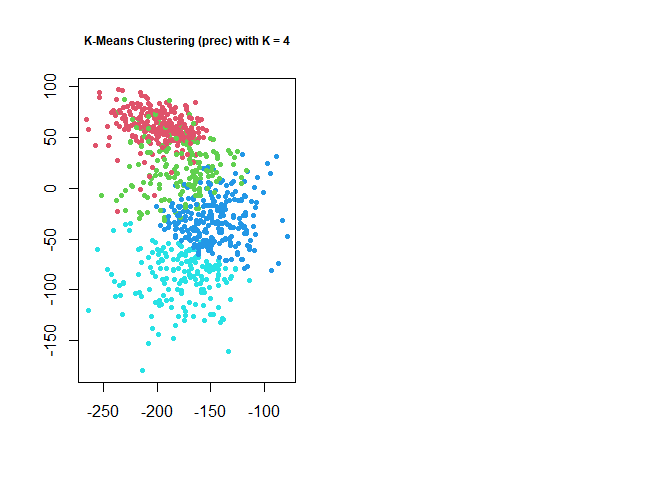<!-- -->

``` r
plot (m1, col = (km2$cluster + 1),
      main = "K-Means Clustering (prec) with K = 6",
      xlab = "", ylab = "", pch = 20, cex = 1,cex.main = 0.75)


km3 <- kmeans(m1, 2, nstart = 20)
km.out$cluster
```

    ##   [1] 3 4 3 4 4 3 3 3 3 3 3 3 3 3 3 3 3 3 3 3 3 3 3 3 3 3 3 3 3 3 3 3 3 3 3 3 3
    ##  [38] 3 3 4 4 4 1 4 4 4 4 4 4 4 4 4 4 4 4 4 4 4 3 4 4 4 4 4 4 4 4 4 4 4 4 4 4 4
    ##  [75] 4 3 3 3 3 3 3 3 3 3 3 3 3 3 3 3 3 3 3 3 3 3 3 3 3 3 3 3 3 3 3 3 3 3 3 4 4
    ## [112] 4 1 1 1 1 4 4 1 1 1 1 1 4 4 4 4 4 4 4 4 4 4 4 4 4 4 4 4 4 4 4 4 4 4 4 4 4
    ## [149] 4 4 4 4 4 4 3 4 4 4 4 4 4 4 3 3 3 3 3 3 3 3 3 3 3 3 3 4 3 3 3 3 3 4 4 4 4
    ## [186] 4 4 4 4 4 4 4 4 4 3 3 3 3 3 3 3 3 3 3 3 4 4 4 4 4 4 1 4 1 1 1 4 4 4 4 4 4
    ## [223] 4 4 4 4 4 4 3 3 3 3 4 4 3 3 3 3 3 3 3 3 3 3 3 4 4 4 4 4 4 4 4 4 4 4 4 4 4
    ## [260] 4 4 4 4 4 4 4 4 4 3 3 3 3 3 3 3 3 3 3 3 3 3 3 3 3 3 3 3 3 3 4 4 4 4 4 1 1
    ## [297] 1 1 1 1 1 1 4 3 3 3 3 3 3 3 3 3 3 3 3 3 3 3 3 3 3 3 3 3 3 3 3 3 3 3 3 3 3
    ## [334] 3 3 3 3 3 3 3 3 4 4 4 4 4 4 4 1 4 4 4 4 4 4 4 4 4 4 4 4 4 4 4 4 4 4 4 3 4
    ## [371] 4 4 4 4 4 4 4 4 4 4 4 4 4 4 4 4 4 4 4 4 4 4 4 4 4 4 4 4 4 4 4 2 4 4 4 4 4
    ## [408] 4 2 4 4 4 4 4 4 1 1 1 1 1 1 1 1 1 1 1 1 1 4 2 2 4 4 2 4 4 2 4 4 4 4 4 3 3
    ## [445] 3 3 3 3 3 4 4 4 4 4 4 4 4 4 4 4 4 4 4 4 4 4 1 1 1 1 1 1 1 1 1 1 1 1 1 1 1
    ## [482] 2 2 2 2 3 3 3 3 3 3 3 3 3 3 2 2 2 2 4 2 4 4 4 4 4 4 4 4 4 4 4 4 4 4 4 4 4
    ## [519] 4 2 4 1 1 4 4 1 1 1 1 1 1 1 1 1 4 4 4 4 4 4 4 1 1 1 1 1 4 4 4 4 4 4 4 4 4
    ## [556] 4 4 4 4 4 4 1 1 1 1 4 4 4 4 4 2 2 2 2 2 2 2 2 2 2 2 2 2 2 2 2 4 2 4 2 2 4
    ## [593] 1 1 1 1 1 1 1 1 1 1 1 1 1 1 2 2 2 2 2 2 3 3 2 3 3 3 3 3 3 3 3 3 3 3 2 2 2
    ## [630] 2 4 2 2 2 2 2 2 2 2 2 2 2 2 2 2 2 2 2 2 2 2 2 2 2 2 2 2 1 1 1 2 4 2 2 2 2
    ## [667] 2 2 2 2 2 2 2 2 2 2 2 2 2 2 2 2 1 2 2 2 4 2 2 2 2 2 2 2 2 2 2 2 2 2 2 2 2
    ## [704] 1 1 1 1 1 1 2 2 2 2 2 2 2 2 3 3 3 3 3 2 2 2 2 2 2 2 2 2 2 2 2 2 2 2 2 2 2
    ## [741] 2 1 1 1 1 1 2 2 2 2 2 3 3 3 3 3 3 3 3 2 2 2 2 3 3 3 3 3 2 2 2 2 2 2 2 4 2
    ## [778] 2 2 2 2 2 2 2 2 2 2 2 2 2 2 2 2 2 2 2 2 2 2 2 2 2 1 2 2 2 2 1 1 1 1 1 1 1
    ## [815] 1 1 1 1 1 1 2 2 2 2 2 2 2 2 2 2 2 2 2 2 2 2 2 2 2 2 2 2

``` r
par (mfrow = c(1, 2))
```

<!-- -->

``` r
plot (m1, col = (km3$cluster + 1),
      main = "K-Means Clustering (prec) with K = 2",
      xlab = "", ylab = "", pch = 20, cex = 1,cex.main = 0.75)
```

<!-- -->

# Part4: regularization

``` r
library(readxl)
Data<-read_excel('F:\\courses\\STAT\\8330 data analysis 3\\project3\\github\\STAT8330-Final-Project\\Final_Project_4C.xlsx')
Data
```

    ## # A tibble: 8,420 x 7
    ##    NA_Section Pacific_Section Month  Year Season Average_Prec Average_SST
    ##         <dbl>           <dbl> <dbl> <dbl>  <dbl>        <dbl>       <dbl>
    ##  1          1               1     1     1      4         1.61     -0.335 
    ##  2          1               1     2     1      4         1.30     -0.660 
    ##  3          1               1     3     1      1         1.52     -0.478 
    ##  4          1               1     4     1      1         1.54     -0.295 
    ##  5          1               1     5     1      1         1.91     -0.0824
    ##  6          1               1     6     1      2         2.01     -0.398 
    ##  7          1               1     7     1      2         3.03     -0.475 
    ##  8          1               1     8     1      2         2.65     -0.313 
    ##  9          1               1     9     1      3         4.43     -0.385 
    ## 10          1               1    10     1      3         2.32     -0.198 
    ## # ... with 8,410 more rows

``` r
Data2 <- read_excel('F:\\courses\\STAT\\8330 data analysis 3\\project3\\github\\STAT8330-Final-Project\\Final_Project_Section_Split.xlsx')
Data2
```

    ## # A tibble: 8,420 x 25
    ##    Average_Prec Average_SST Month  Year Season  NA_1   P_1  NA_2   P_2  NA_3
    ##           <dbl>       <dbl> <dbl> <dbl>  <dbl> <dbl> <dbl> <dbl> <dbl> <dbl>
    ##  1         1.61     -0.335      1     1      4     1     1     0     0     0
    ##  2         1.30     -0.660      2     1      4     1     1     0     0     0
    ##  3         1.52     -0.478      3     1      1     1     1     0     0     0
    ##  4         1.54     -0.295      4     1      1     1     1     0     0     0
    ##  5         1.91     -0.0824     5     1      1     1     1     0     0     0
    ##  6         2.01     -0.398      6     1      2     1     1     0     0     0
    ##  7         3.03     -0.475      7     1      2     1     1     0     0     0
    ##  8         2.65     -0.313      8     1      2     1     1     0     0     0
    ##  9         4.43     -0.385      9     1      3     1     1     0     0     0
    ## 10         2.32     -0.198     10     1      3     1     1     0     0     0
    ## # ... with 8,410 more rows, and 15 more variables: P_3 <dbl>, NA_4 <dbl>,
    ## #   P_4 <dbl>, NA_5 <dbl>, P_5 <dbl>, NA_6 <dbl>, P_6 <dbl>, NA_7 <dbl>,
    ## #   P_7 <dbl>, NA_8 <dbl>, P_8 <dbl>, NA_9 <dbl>, P_9 <dbl>, NA_10 <dbl>,
    ## #   P_10 <dbl>

``` r
Data$NA_Section <- as.factor(Data$NA_Section)
Data$Pacific_Section <- as.factor(Data$Pacific_Section)
Data$Season <- as.factor(Data$Season)

Data2$NA_1 <- as.factor(Data2$NA_1)
Data2$NA_2 <- as.factor(Data2$NA_2)
Data2$NA_3 <- as.factor(Data2$NA_3)
Data2$NA_4 <- as.factor(Data2$NA_4)
Data2$NA_5 <- as.factor(Data2$NA_5)
Data2$NA_6 <- as.factor(Data2$NA_6)
Data2$NA_7 <- as.factor(Data2$NA_7)
Data2$NA_8 <- as.factor(Data2$NA_8)
Data2$NA_9 <- as.factor(Data2$NA_9)
Data2$NA_10 <- as.factor(Data2$NA_10)
Data2$P_1 <- as.factor(Data2$P_1)
Data2$P_2 <- as.factor(Data2$P_2)
Data2$P_3 <- as.factor(Data2$P_3)
Data2$P_4 <- as.factor(Data2$P_4)
Data2$P_5 <- as.factor(Data2$P_5)
Data2$P_6 <- as.factor(Data2$P_6)
Data2$P_7 <- as.factor(Data2$P_7)
Data2$P_8 <- as.factor(Data2$P_8)
Data2$P_9 <- as.factor(Data2$P_9)
Data2$P_10 <- as.factor(Data2$P_10)
Data2$Pacific_Section <- as.factor(Data$Pacific_Section)
Data2$Season <- as.factor(Data$Season)
Data2$Month <- as.factor(Data$Month)
Data2$Year <- as.factor(Data$Year)
quantile(Data2$Average_Prec)
```

    ##        0%       25%       50%       75%      100% 
    ## 0.4867404 1.6778981 2.0618437 2.4737630 4.9702105

``` r
Data2$Average_Prec<-ifelse(Data2$Average_Prec>=2.4737630 & Data2$Average_Prec<=4.9702105,4,Data2$Average_Prec)
Data2$Average_Prec<-ifelse(Data2$Average_Prec>=2.0618437 & Data2$Average_Prec<2.4737630,3,Data2$Average_Prec)
Data2$Average_Prec<-ifelse(Data2$Average_Prec>=1.6778981 & Data2$Average_Prec<2.0618437,2,Data2$Average_Prec)
Data2$Average_Prec<-ifelse(Data2$Average_Prec>=0.4 & Data2$Average_Prec<1.6778981,1,Data2$Average_Prec)
Average_Prec_factor <- as.factor(Data2$Average_Prec)
#Data2$Average_Prec
plot(Average_Prec_factor)
```

<!-- -->

``` r
#define matrix of predictor variables
x <- data.matrix(Data[, c('NA_Section', 'Pacific_Section', 'Month', 'Average_SST', 'Year', 'Season')])
y <- Data$Average_Prec

x1 <- data.matrix(Data2[, c('NA_1','NA_2','NA_3','NA_4','NA_5','NA_6','NA_7','NA_8','NA_9','NA_10',
                            'P_1', 'P_2', 'P_3', 'P_4', 'P_5', 'P_6', 'P_7', 'P_8', 'P_9', 'P_10',
                            'Month', 'Year', 'Average_SST', 'Season')])
x2 <- data.matrix(Data2[, c('NA_1','NA_2','NA_3','NA_4','NA_5','NA_6','NA_7','NA_8','NA_9','NA_10',
                             'P_2', 'P_3', 'P_4', 'P_7', 'P_8', 'P_9', 'P_10',
                            'Month', 'Year', 'Average_SST', 'Season')])

y1 <- Data2$Average_Prec

library(glmnet)
```

    ## Loading required package: Matrix

    ## 
    ## Attaching package: 'Matrix'

    ## The following object is masked from 'package:spam':
    ## 
    ##     det

    ## The following objects are masked from 'package:tidyr':
    ## 
    ##     expand, pack, unpack

    ## Loaded glmnet 4.1-3

``` r
cv_model <- cv.glmnet(x1, y1, alpha = 1)
best_lambda <- cv_model$lambda.min
best_lambda
```

    ## [1] 1.604647e-05

``` r
plot(cv_model)
```

<!-- -->

``` r
model_cv <- glmnet(x1, y, alpha = 1, lambda = best_lambda, standardize = TRUE)
coef(model_cv)
```

    ## 25 x 1 sparse Matrix of class "dgCMatrix"
    ##                        s0
    ## (Intercept)  2.029541e+00
    ## NA_1        -1.680569e-02
    ## NA_2         1.453991e-01
    ## NA_3         1.066256e-01
    ## NA_4         1.587233e-01
    ## NA_5         1.282231e-01
    ## NA_6         7.052995e-02
    ## NA_7        -7.965427e-06
    ## NA_8        -8.047452e-02
    ## NA_9        -3.086795e-02
    ## NA_10       -1.250357e-01
    ## P_1          .           
    ## P_2          2.530176e-02
    ## P_3          1.626578e-02
    ## P_4          4.371664e-04
    ## P_5          .           
    ## P_6          .           
    ## P_7         -2.158461e-03
    ## P_8         -1.289527e-02
    ## P_9         -1.089830e-02
    ## P_10        -6.969361e-03
    ## Month        1.920768e-02
    ## Year        -2.310966e-01
    ## Average_SST  1.399353e-01
    ## Season      -8.018316e-02

``` r
cv_model <- cv.glmnet(x2, y1, alpha = 1)
best_lambda <- cv_model$lambda.min
best_lambda
```

    ## [1] 1.604647e-05

``` r
plot(cv_model)
```

<!-- -->

``` r
model_cv <- glmnet(x2, y1, alpha = 1, lambda = best_lambda, standardize = TRUE)
coef(model_cv)
```

    ## 22 x 1 sparse Matrix of class "dgCMatrix"
    ##                        s0
    ## (Intercept)  2.569605e+00
    ## NA_1        -1.110890e-01
    ## NA_2         1.454093e-01
    ## NA_3         1.728888e-01
    ## NA_4         2.947165e-01
    ## NA_5         2.655930e-01
    ## NA_6         1.586368e-01
    ## NA_7        -1.496045e-05
    ## NA_8        -1.531693e-01
    ## NA_9        -5.495382e-02
    ## NA_10       -2.401472e-01
    ## P_2          4.928332e-02
    ## P_3          3.554937e-02
    ## P_4          6.753025e-03
    ## P_7         -8.853298e-05
    ## P_8         -2.262265e-02
    ## P_9         -1.903029e-02
    ## P_10        -8.727192e-04
    ## Month        3.693133e-02
    ## Year        -4.442243e-01
    ## Average_SST  2.430699e-01
    ## Season      -1.621714e-01

``` r
Reduced_Data <- Data2[, -which(names(Data2) %in% c('P_1', 'P_5', 'P_6'))]
Reduced_Data
```

    ## # A tibble: 8,420 x 23
    ##    Average_Prec Average_SST Month Year  Season NA_1  NA_2  P_2   NA_3  P_3  
    ##           <dbl>       <dbl> <fct> <fct> <fct>  <fct> <fct> <fct> <fct> <fct>
    ##  1            1     -0.335  1     1     4      1     0     0     0     0    
    ##  2            1     -0.660  2     1     4      1     0     0     0     0    
    ##  3            1     -0.478  3     1     1      1     0     0     0     0    
    ##  4            1     -0.295  4     1     1      1     0     0     0     0    
    ##  5            2     -0.0824 5     1     1      1     0     0     0     0    
    ##  6            2     -0.398  6     1     2      1     0     0     0     0    
    ##  7            4     -0.475  7     1     2      1     0     0     0     0    
    ##  8            4     -0.313  8     1     2      1     0     0     0     0    
    ##  9            4     -0.385  9     1     3      1     0     0     0     0    
    ## 10            3     -0.198  10    1     3      1     0     0     0     0    
    ## # ... with 8,410 more rows, and 13 more variables: NA_4 <fct>, P_4 <fct>,
    ## #   NA_5 <fct>, NA_6 <fct>, NA_7 <fct>, P_7 <fct>, NA_8 <fct>, P_8 <fct>,
    ## #   NA_9 <fct>, P_9 <fct>, NA_10 <fct>, P_10 <fct>, Pacific_Section <fct>
