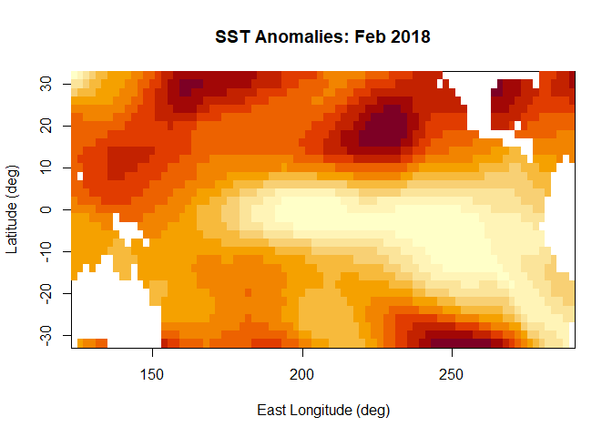
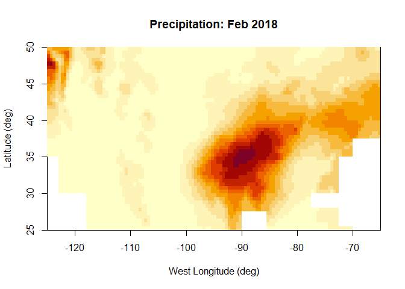
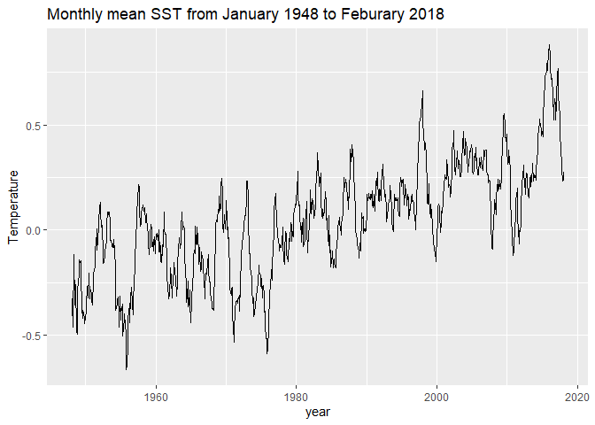
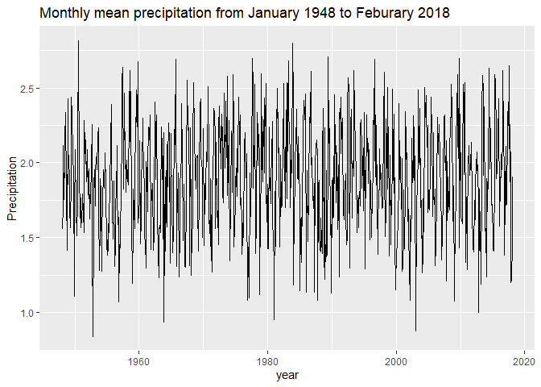
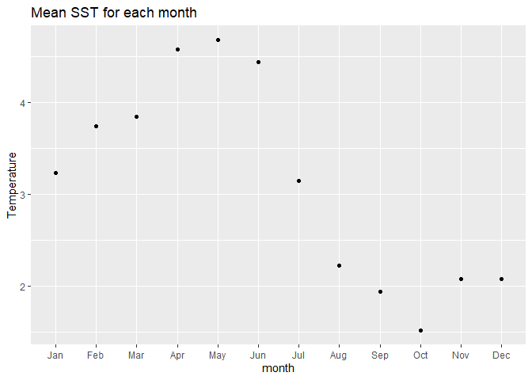
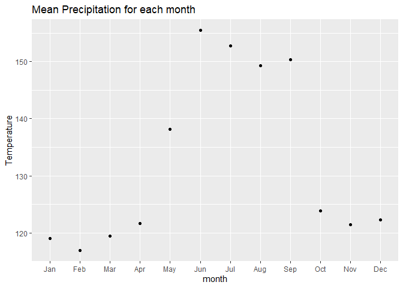

project3
================
12/08/2021

<!-- #Above is the header. there are options to change formatting if the default doesn't suit your style -->
<!-- #Below is an example of an r code chunk, Code->Insert Chunk (or Ctrl+Alt+I / Cmd+Option +I) the r means it is an r code chunk, the next word is the chunk title, and after the comma is chunk options--->

``` r
# needed packages ---------------------------------------------------------
# uncomment install lines if you do not have the package and comment them after you are done!
#install.packages("ncdf4")
library(ncdf4) # package for netcdf manipulation
#install.packages("raster")
library(raster) # package for raster manipulation
```

    ## Loading required package: sp

``` r
#install.packages("rgdal")
library(rgdal) # package for geospatial analysis
```

    ## Please note that rgdal will be retired by the end of 2023,
    ## plan transition to sf/stars/terra functions using GDAL and PROJ
    ## at your earliest convenience.
    ## 
    ## rgdal: version: 1.5-27, (SVN revision 1148)
    ## Geospatial Data Abstraction Library extensions to R successfully loaded
    ## Loaded GDAL runtime: GDAL 3.2.1, released 2020/12/29
    ## Path to GDAL shared files: C:/Users/70950/Documents/R/win-library/4.0/rgdal/gdal
    ## GDAL binary built with GEOS: TRUE 
    ## Loaded PROJ runtime: Rel. 7.2.1, January 1st, 2021, [PJ_VERSION: 721]
    ## Path to PROJ shared files: C:/Users/70950/Documents/R/win-library/4.0/rgdal/proj
    ## PROJ CDN enabled: FALSE
    ## Linking to sp version:1.4-6
    ## To mute warnings of possible GDAL/OSR exportToProj4() degradation,
    ## use options("rgdal_show_exportToProj4_warnings"="none") before loading sp or rgdal.
    ## Overwritten PROJ_LIB was C:/Users/70950/Documents/R/win-library/4.0/rgdal/proj

``` r
library(ggplot2) # package for plotting


# reading the data
nc_SST_orig <- nc_open('F:\\courses\\STAT\\8330 data analysis 3\\project3\\SSTdata_011948_022018.nc')
nc_prec_orig <- nc_open('F:\\courses\\STAT\\8330 data analysis 3\\project3\\Pdata_011948_022018-1.nc')

##### SST variables 
zlev <- ncvar_get(nc_SST_orig, "zlev")
# East Longitude (deg)
X_SST <- ncvar_get(nc_SST_orig, "X")
print (dim(X_SST))
```

    ## [1] 84

``` r
# time from Jan. 1948 to Feb. 2018 
# 12*(2018-1948)+1(Jan 2018)+1(Feb 2018) = 842
T_SST <- ncvar_get(nc_SST_orig, "T")
print (dim(T_SST))
```

    ## [1] 842

``` r
# Latitude (deg)
Y_SST <- ncvar_get(nc_SST_orig, "Y")
print (dim(Y_SST))
```

    ## [1] 33

``` r
SST_anom <- ncvar_get(nc_SST_orig, "anom")
print (dim(SST_anom))
```

    ## [1]  84  33 842

``` r
image(x=X_SST, y=Y_SST, z=SST_anom[,,842], 
      col = hcl.colors(12, "YlOrRd", rev = TRUE),
      xlab="East Longitude (deg)",
      ylab="Latitude (deg)", main="SST Anomalies: Feb 2018")
```

<!-- -->

``` r
##### precipitation variables
# East Longitude (deg)
X_prec <- ncvar_get(nc_prec_orig, "X")
print (dim(X_prec))
```

    ## [1] 120

``` r
# time 
T_prec <- ncvar_get(nc_prec_orig, "T")
print (dim(T_prec))
```

    ## [1] 842

``` r
# Latitude (deg)
Y_prec <- ncvar_get(nc_prec_orig, "Y")
print (dim(Y_prec))
```

    ## [1] 50

``` r
# Precipitation
prec <- ncvar_get(nc_prec_orig, "rain")
# reproduce the image in file
image(x=X_prec, y=Y_prec, z=prec[,,842], 
      col = hcl.colors(12, "YlOrRd", rev = TRUE),
      xlab="West Longitude (deg)",
      ylab="Latitude (deg)", main="Precipitation: Feb 2018")
```

<!-- -->

``` r
#prec
prec[is.na(prec)] <- 0
#prec
#quantile(prec)
#prec<-ifelse(prec>2.8619213 & prec<=31.719044,5,prec)
#prec<-ifelse(prec>1.4166624 & prec<=2.8619213,4,prec)
#prec<-ifelse(prec>0.3640884 & prec<=1.4166624,3,prec)
#prec<-ifelse(prec>0 & prec<=0.3640884,2,prec)
#prec<-ifelse(prec==0,1,prec)
#prec
#prec <- as.factor(prec)
#prec
#plot(prec)
```

``` r
library(ncdf4)
library(lubridate)
```

    ## 
    ## Attaching package: 'lubridate'

    ## The following objects are masked from 'package:raster':
    ## 
    ##     intersect, union

    ## The following objects are masked from 'package:base':
    ## 
    ##     date, intersect, setdiff, union

``` r
library(ggplot2)
library(tidyverse)
```

    ## -- Attaching packages --------------------------------------- tidyverse 1.3.1 --

    ## v tibble  3.0.6     v dplyr   1.0.4
    ## v tidyr   1.1.4     v stringr 1.4.0
    ## v readr   1.4.0     v forcats 0.5.1
    ## v purrr   0.3.4

    ## -- Conflicts ------------------------------------------ tidyverse_conflicts() --
    ## x lubridate::as.difftime() masks base::as.difftime()
    ## x lubridate::date()        masks base::date()
    ## x tidyr::extract()         masks raster::extract()
    ## x dplyr::filter()          masks stats::filter()
    ## x lubridate::intersect()   masks raster::intersect(), base::intersect()
    ## x dplyr::lag()             masks stats::lag()
    ## x dplyr::select()          masks raster::select()
    ## x lubridate::setdiff()     masks base::setdiff()
    ## x lubridate::union()       masks raster::union(), base::union()

``` r
library(ggthemes)
library(forecast)
```

    ## Registered S3 method overwritten by 'quantmod':
    ##   method            from
    ##   as.zoo.data.frame zoo

``` r
library(reshape2)
```

    ## 
    ## Attaching package: 'reshape2'

    ## The following object is masked from 'package:tidyr':
    ## 
    ##     smiths

``` r
library(zoo)
```

    ## 
    ## Attaching package: 'zoo'

    ## The following objects are masked from 'package:base':
    ## 
    ##     as.Date, as.Date.numeric

``` r
library(ggfortify)
```

    ## Registered S3 methods overwritten by 'ggfortify':
    ##   method                 from    
    ##   autoplot.Arima         forecast
    ##   autoplot.acf           forecast
    ##   autoplot.ar            forecast
    ##   autoplot.bats          forecast
    ##   autoplot.decomposed.ts forecast
    ##   autoplot.ets           forecast
    ##   autoplot.forecast      forecast
    ##   autoplot.stl           forecast
    ##   autoplot.ts            forecast
    ##   fitted.ar              forecast
    ##   fortify.ts             forecast
    ##   residuals.ar           forecast

``` r
library(magrittr) # needs to be run every time you start R and want to use %>%
```

    ## 
    ## Attaching package: 'magrittr'

    ## The following object is masked from 'package:purrr':
    ## 
    ##     set_names

    ## The following object is masked from 'package:tidyr':
    ## 
    ##     extract

    ## The following object is masked from 'package:raster':
    ## 
    ##     extract

``` r
library(dplyr)    # alternatively, this also loads %>%

par(mfrow=c(2,1))

lon_sst <- ncvar_get(nc_SST_orig,"X")
lat_sst <- ncvar_get(nc_SST_orig,"Y")
time_sst <- ncvar_get(nc_SST_orig,"T")
time_sst = time_sst * 30.42
time_sst <- as.Date(time_sst, origin="1960-1-1 00:00", tz="UTC")
sst_anom <- ncvar_get(nc_SST_orig, "anom")
sst_mean <- apply(sst_anom,3,mean,na.rm=TRUE)

tempseries <- data.frame(year=time_sst,sst=sst_mean)
tempseries %>% ggplot(aes(x=year,y=sst))+geom_line()+labs(title = "Monthly mean SST from January 1948 to Feburary 2018", x="year",y="Temperature" )
```

<!-- -->

``` r
lon_prec <- ncvar_get(nc_prec_orig,"X")
lat_prec <- ncvar_get(nc_prec_orig,"Y")
time_prec <- ncvar_get(nc_prec_orig,"T")
time_prec = time_prec * 30.42
time_prec <- as.Date(time_prec, origin="1960-1-1 00:00", tz="UTC")
prec_anom <- ncvar_get(nc_prec_orig)
prec_anom[is.na(prec_anom)] <- 0
prec_anom[prec_anom<0] <- 0
prec_mean <- apply(prec_anom,3,mean,na.rm=TRUE)

tempseries <- data.frame(year=time_prec,prec=prec_mean)
tempseries %>% ggplot(aes(x=year,y=prec))+geom_line()+labs(title = "Monthly mean precipitation from January 1948 to Feburary 2018", x="year",y="Precipitation" )
```

<!-- -->

``` r
par(mfrow=c(2,1))
tempseries <- data.frame(year=time_sst,sst=sst_mean)
month_mean_sst = rep(0, 12)
for (i in 1:nrow(tempseries))
{
   month = as.numeric(substr(as.character(tempseries[i,1]),6,7))
   month_mean_sst[month] = month_mean_sst[month] + tempseries[i,2]
}
month_mean_sst = data.frame(month_num=factor(c(1:12)), month_name=c("Jan", "Feb", "Mar", "Apr", "May", "Jun", "Jul", "Aug", "Sep", "Oct", "Nov", "Dec"), sst=month_mean_sst)


ggplot(month_mean_sst, aes(x=factor(month_num),y=sst))+geom_point(aes(x=month_num,y=sst)) + scale_x_discrete(breaks = factor(c(1:12)), labels=c("Jan", "Feb", "Mar", "Apr", "May", "Jun", "Jul", "Aug", "Sep", "Oct", "Nov", "Dec")) + labs(title = "Mean SST for each month", x="month",y="Temperature" )
```

<!-- -->

``` r
tempseries <- data.frame(year=time_prec,prec=prec_mean)
month_mean_prec = rep(0, 12)
for (i in 1:nrow(tempseries))
{
   month = as.numeric(substr(as.character(tempseries[i,1]),6,7))
   month_mean_prec[month] = month_mean_prec[month] + tempseries[i,2]
}
month_mean_prec = data.frame(month_num=factor(c(1:12)), prec=month_mean_prec, month_name=c("Jan", "Feb", "Mar", "Apr", "May", "Jun", "Jul", "Aug", "Sep", "Oct", "Nov", "Dec"))
ggplot(month_mean_prec, aes(x=factor(month_num),y=prec))+geom_point(aes(x=month_num,y=prec)) + scale_x_discrete(breaks = c(1:12), labels=c("Jan", "Feb", "Mar", "Apr", "May", "Jun", "Jul", "Aug", "Sep", "Oct", "Nov", "Dec")) + labs(title = "Mean Precipitation for each month", x="month",y="Temperature")
```

<!-- -->
