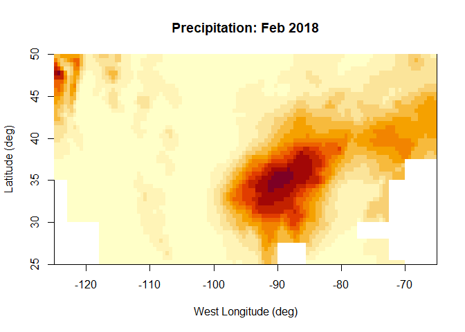
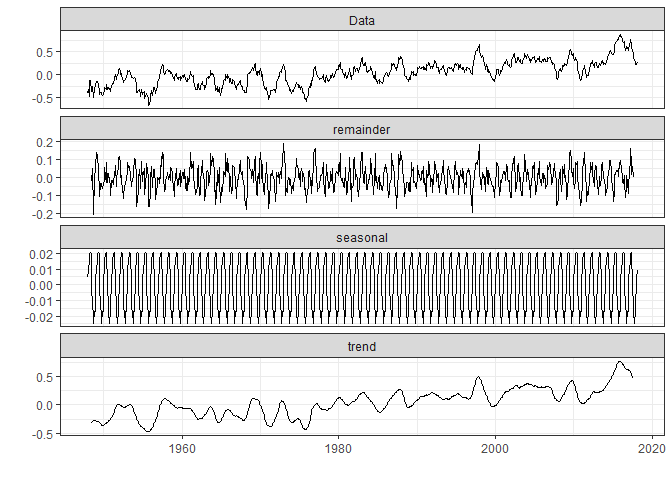

project3
================
12/08/2021

<!-- #Above is the header. there are options to change formatting if the default doesn't suit your style -->
<!-- #Below is an example of an r code chunk, Code->Insert Chunk (or Ctrl+Alt+I / Cmd+Option +I) the r means it is an r code chunk, the next word is the chunk title, and after the comma is chunk options--->

``` r
#Load in libraries 
library(ncdf4)
library(lubridate)
```

    ## 
    ## Attaching package: 'lubridate'

    ## The following objects are masked from 'package:base':
    ## 
    ##     date, intersect, setdiff, union

``` r
library(ggplot2)
library(tidyverse)
```

    ## -- Attaching packages --------------------------------------- tidyverse 1.3.1 --

    ## v tibble  3.0.6     v dplyr   1.0.4
    ## v tidyr   1.1.4     v stringr 1.4.0
    ## v readr   1.4.0     v forcats 0.5.1
    ## v purrr   0.3.4

    ## -- Conflicts ------------------------------------------ tidyverse_conflicts() --
    ## x lubridate::as.difftime() masks base::as.difftime()
    ## x lubridate::date()        masks base::date()
    ## x dplyr::filter()          masks stats::filter()
    ## x lubridate::intersect()   masks base::intersect()
    ## x dplyr::lag()             masks stats::lag()
    ## x lubridate::setdiff()     masks base::setdiff()
    ## x lubridate::union()       masks base::union()

``` r
#install.packages("ggthemes")
library(ggthemes)
#install.packages("forecast")
library(forecast)
```

    ## Registered S3 method overwritten by 'quantmod':
    ##   method            from
    ##   as.zoo.data.frame zoo

``` r
library(reshape2)
```

    ## 
    ## Attaching package: 'reshape2'

    ## The following object is masked from 'package:tidyr':
    ## 
    ##     smiths

``` r
library(zoo)
```

    ## 
    ## Attaching package: 'zoo'

    ## The following objects are masked from 'package:base':
    ## 
    ##     as.Date, as.Date.numeric

``` r
#install.packages ("ggfortify")
library(ggfortify)
```

    ## Registered S3 methods overwritten by 'ggfortify':
    ##   method                 from    
    ##   autoplot.Arima         forecast
    ##   autoplot.acf           forecast
    ##   autoplot.ar            forecast
    ##   autoplot.bats          forecast
    ##   autoplot.decomposed.ts forecast
    ##   autoplot.ets           forecast
    ##   autoplot.forecast      forecast
    ##   autoplot.stl           forecast
    ##   autoplot.ts            forecast
    ##   fitted.ar              forecast
    ##   fortify.ts             forecast
    ##   residuals.ar           forecast

``` r
library(magrittr) # needs to be run every time you start R and want to use %>%
```

    ## 
    ## Attaching package: 'magrittr'

    ## The following object is masked from 'package:purrr':
    ## 
    ##     set_names

    ## The following object is masked from 'package:tidyr':
    ## 
    ##     extract

``` r
library(dplyr)    # alternatively, this also loads %>%
library(rgdal) # package for geospatial analysis
```

    ## Loading required package: sp

    ## Please note that rgdal will be retired by the end of 2023,
    ## plan transition to sf/stars/terra functions using GDAL and PROJ
    ## at your earliest convenience.
    ## 
    ## rgdal: version: 1.5-27, (SVN revision 1148)
    ## Geospatial Data Abstraction Library extensions to R successfully loaded
    ## Loaded GDAL runtime: GDAL 3.2.1, released 2020/12/29
    ## Path to GDAL shared files: C:/Users/70950/Documents/R/win-library/4.0/rgdal/gdal
    ## GDAL binary built with GEOS: TRUE 
    ## Loaded PROJ runtime: Rel. 7.2.1, January 1st, 2021, [PJ_VERSION: 721]
    ## Path to PROJ shared files: C:/Users/70950/Documents/R/win-library/4.0/rgdal/proj
    ## PROJ CDN enabled: FALSE
    ## Linking to sp version:1.4-6
    ## To mute warnings of possible GDAL/OSR exportToProj4() degradation,
    ## use options("rgdal_show_exportToProj4_warnings"="none") before loading sp or rgdal.
    ## Overwritten PROJ_LIB was C:/Users/70950/Documents/R/win-library/4.0/rgdal/proj

``` r
library(ggplot2) # package for plotting
library(sf)
```

    ## Linking to GEOS 3.9.1, GDAL 3.2.1, PROJ 7.2.1

``` r
library(rnaturalearth)
library(rnaturalearthdata)
library(ggspatial)
library(fields)
```

    ## Loading required package: spam

    ## Loading required package: dotCall64

    ## Loading required package: grid

    ## Spam version 2.7-0 (2021-06-25) is loaded.
    ## Type 'help( Spam)' or 'demo( spam)' for a short introduction 
    ## and overview of this package.
    ## Help for individual functions is also obtained by adding the
    ## suffix '.spam' to the function name, e.g. 'help( chol.spam)'.

    ## 
    ## Attaching package: 'spam'

    ## The following objects are masked from 'package:base':
    ## 
    ##     backsolve, forwardsolve

    ## Loading required package: viridis

    ## Loading required package: viridisLite

    ## 
    ## Try help(fields) to get started.

    ## 
    ## Attaching package: 'fields'

    ## The following object is masked from 'package:ggfortify':
    ## 
    ##     unscale

``` r
library(RColorBrewer)
library(magrittr) # needs to be run every time you start R and want to use %>%
library(dplyr)    # alternatively, this also loads %>%
```

``` r
# reading the data
nc_sst_orig <- nc_open('F:\\courses\\STAT\\8330 data analysis 3\\project3\\SSTdata_011948_022018.nc')
nc_prec_orig <- nc_open('F:\\courses\\STAT\\8330 data analysis 3\\project3\\Pdata_011948_022018-1.nc')
##### sst variables 
zlev <- ncvar_get(nc_sst_orig, "zlev")
# East Longitude (deg)
X_sst <- ncvar_get(nc_sst_orig, "X")
print (dim(X_sst))
```

    ## [1] 84

``` r
# time from Jan. 1948 to Feb. 2018 
# 12*(2018-1948)+1(Jan 2018)+1(Feb 2018) = 842
time_sst <- ncvar_get(nc_sst_orig, "T")
#print (dim(time_sst))
# Latitude (deg)
Y_sst <- ncvar_get(nc_sst_orig, "Y")
#print (dim(Y_sst))
sst_anom <- ncvar_get(nc_sst_orig, "anom")
#print (dim(sst_anom))
#jpeg("sst_Feb2018.png", width=1600, height=1600, res=300)
image(x=X_sst, y=Y_sst, z=sst_anom[,,842], 
      col = hcl.colors(12, "YlOrRd", rev = TRUE),
      xlab="East Longitude (deg)",
      ylab="Latitude (deg)", main="sst Anomalies: Feb 2018")
```

<!-- -->

``` r
#dev.off()
##### precipitation variables
# East Longitude (deg)
X_prec <- ncvar_get(nc_prec_orig, "X")
#print (dim(X_prec))
# time 
time_prec <- ncvar_get(nc_prec_orig, "T")
#print (dim(time_prec))
# Latitude (deg)
Y_prec <- ncvar_get(nc_prec_orig, "Y")
#print (dim(Y_prec))
# Precipitation
prec <- ncvar_get(nc_prec_orig, "rain")
# reproduce the image in file
#jpeg("prec_Feb2018.png", width=1600, height=1600, res=300)
image(x=X_prec, y=Y_prec, z=prec[,,842], 
      col = hcl.colors(12, "YlOrRd", rev = TRUE),
      xlab="West Longitude (deg)",
      ylab="Latitude (deg)", main="Precipitation: Feb 2018")
```

<!-- -->

``` r
#dev.off()
```

# exploratory analysis

``` r
s1 <- which(is.na(sst_anom[,,1]))
s2 <- which(!is.na(sst_anom[,,1]))
sst <- matrix(0, nrow = dim(sst_anom)[3], ncol = length(s2))
for(i in 1:dim(sst_anom)[3])
  sst[i,] <- sst_anom[,,i][-s1]
eof <- svd(sst)$v
loc <- as.matrix(expand.grid(x = X_sst, Y_SST = Y_sst))[s2,]
coltab <- colorRampPalette(brewer.pal(9,"BrBG"))(2048)
# plot the first EOF
par(mar = c(5,5,3,3), oma=c(1,1,1,1))
quilt.plot(loc, eof[,1], nx = length(Y_sst), 
           ny = length(Y_sst), xlab = "longitude",
           ylab = "latitude", 
           main = "1st EOF", col = coltab,
           cex.lab = 3, cex.axis = 3, cex.main = 3,
           legend.cex = 20)
maps::map(database = "world", fill = TRUE, col = "gray", 
          ylim=c(-35, 35), xlim = c(123.9,290.1), add = T)
```

<!-- -->

``` r
# plot the second EOF
par(mar = c(5,5,3,3), oma=c(1,1,1,1))
quilt.plot(loc, eof[,2], nx = length(X_sst), 
           ny = length(Y_sst), xlab = "longitude",
           ylab = "latitude", 
           main = "2nd EOF", col = coltab,
           cex.lab = 3, cex.axis = 3, cex.main = 3,
           legend.cex = 20)
maps::map(database = "world", fill = TRUE, col = "gray", 
          ylim=c(-35, 35), xlim = c(123.9,290.1), add = T)
```

<!-- -->

``` r
lon_sst <- ncvar_get(nc_sst_orig,"X")
lat_sst <- ncvar_get(nc_sst_orig,"Y")
time_sst <- ncvar_get(nc_sst_orig,"T")
time_sst = time_sst * 30.42
time_sst <- as.Date(time_sst, origin="1960-1-1 00:00", tz="UTC")
sst_anom <- ncvar_get(nc_sst_orig, "anom")
sst_mean <- apply(sst_anom,3,mean,na.rm=TRUE)
tempseries <- data.frame(year=time_sst,sst=sst_mean)
tempseries %>% ggplot(aes(x=year,y=sst))+geom_line()+labs(title = "Monthly mean SST from January 1948 to Feburary 2018", x="year",y="Temperature" )
```

<!-- -->

``` r
# Monthly mean,Annual mean and five years moving average
mov_avg <- tempseries %>% select(year, sst) %>% mutate(sst_1yr = rollmean(sst, k = 13, fill = NA, align = "right"), sst_5yr = rollmean(sst, k = 61, fill = NA, align = "right"))
mov_avg %>% gather(key="metrice",value = "value",sst:sst_5yr)%>% ggplot(aes(x=year,y=value,col=metrice))+
  geom_line()+scale_color_manual(values = c("bisque4","darkred","blue"),labels=c("Monthly mean","Annual mean","5 years moving Average"))+
  scale_x_date(limits =ymd(c("1948-01-01","2018-01-01")) ,breaks = seq(ymd("1948-01-01"),ymd("2018-01-01"),"10 years"),date_labels ="%Y")+ 
  scale_y_continuous(breaks = seq(23,33,0.5))+labs( x="year",y="SST [°C]" )+
  theme_clean(base_size = 12,)+
  theme(legend.title = element_blank(),legend.position = c("top"),legend.direction = "horizontal")
```

<!-- -->

``` r
# Decomposing the components of the additive time series
ts <- ts(sst_mean,start = c(1948,1),end = c(2018,2),frequency = 12,class = "ts")
#decomposition of ts object into trend,seasonality and error by additive model
decomposed <- decompose(ts, type = "additive")
#plot the components of an additive time series
theme_set(theme_bw())
autoplot(decomposed)
```

<!-- -->

``` r
#remove seasonality from the ts
decomposed_trend <- ts - decomposed$seasonal
# Plot the linear trend of seasonally adjusted time series
# make a dataframe of the trend 
set.seed(1)
decomposed_trend_df <- data.frame(date =as.Date(as.yearmon(time(decomposed_trend))),sst=as.matrix(decomposed_trend))
decomposed_trend_df %>% ggplot(aes(x=date, y=sst))+
  geom_line(alpha=0.8)+
  geom_smooth(method= "lm", se=FALSE, col="red") + geom_text(x =1940, y = 0.9, label = "y = 28.37 + 0.000027 x , r² = 0.486", hjust=1.5,colour="blue")+
  scale_x_date(limits =ymd(c("1948-01-01","2018-02-01")), breaks = seq(ymd("1948-01-01"), ymd("2018-02-01"),"10 years"), minor_breaks = "1 years", date_labels ="%Y")+
  labs(x="year",y="SST [°C]" )+ 
  scale_y_continuous(breaks = seq(25,32,0.2))+
  theme_clean()
```

    ## `geom_smooth()` using formula 'y ~ x'

<!-- -->

``` r
# Temporal variability of Seasonality
year=time_sst
ts_df <- data.frame(time=year, sst=sst_mean) 

ts_df <- ts_df %>% mutate(year=year(time)) %>% mutate(month= month(time,label=TRUE)) %>% mutate(season = case_when(month %in% c("Nov","Dec","Jan","Feb") ~ "Winter", month %in% c("Mar","Apr","May") ~ "Spring", month %in% c("Jun","Jul","Aug") ~ "Summer", month %in%  c("Sep","Oct") ~ "Fall", TRUE ~ NA_character_) ) %>% select(-time)  %>%  as_tibble()
ts_df$season <- as.factor(ts_df$season)
ts_df %>% ggplot(aes(x=month,y=sst,fill=season)) + geom_boxplot(position = position_dodge(width = 0.7))+scale_y_continuous(breaks = seq(20,35,0.5))+labs(x="month",y="SST [°C]")+scale_fill_manual(values = c("antiquewhite4","darkolivegreen4","chocolate4","cornflowerblue"))+theme_clean()+theme(legend.title = element_blank())
```

<!-- -->

``` r
prec_s1 <- which(is.na(prec[,,1]))
prec_s2 <- which(!is.na(prec[,,1]))
prec_sst <- matrix(0, nrow = dim(prec)[3], ncol = length(prec_s2))
for(i in 1:dim(prec)[3])
   prec_sst[i,] <- prec[,,i][-prec_s1]
prec_eof <- svd(prec_sst)$v
loc <- as.matrix(expand.grid(x = X_prec, Y_prec = Y_prec))[prec_s2,]
coltab <- colorRampPalette(brewer.pal(9,"BrBG"))(2048)
# plot the first EOF
par(mfrow=c(1,1))
quilt.plot(loc, prec_eof[,1], nx = length(X_prec), 
           ny = length(Y_prec), xlab = "longitude",
           ylab = "latitude", 
           main = "1st EOF", col = coltab,
           cex.lab = 3, cex.axis = 3, cex.main = 3,
           legend.cex = 20)
maps::map(database = "world", fill = TRUE, col = "gray", 
          ylim=c(-35, 35), xlim = c(123.9,290.1), add = T)
```

<!-- -->

``` r
# plot the second EOF
par(mar = c(5,5,3,3), oma=c(1,1,1,1))
quilt.plot(loc, prec_eof[,2], nx = length(X_prec), 
           ny = length(Y_prec), xlab = "longitude",
           ylab = "latitude", 
           main = "2nd EOF", col = coltab,
           cex.lab = 3, cex.axis = 3, cex.main = 3,
           legend.cex = 20)
maps::map(database = "world", fill = TRUE, col = "gray", 
          ylim=c(-35, 35), xlim = c(123.9,290.1), add = T)
```

<!-- -->

``` r
lon_prec <- ncvar_get(nc_prec_orig,"X")
lat_prec <- ncvar_get(nc_prec_orig,"Y")
time_prec <- ncvar_get(nc_prec_orig,"T")
time_prec = time_prec * 30.42
time_prec <- as.Date(time_prec, origin="1960-1-1 00:00", tz="UTC")
prec_mean <- apply(prec,3,mean,na.rm=TRUE)
tempseries <- data.frame(year=time_prec,prec=prec_mean)
tempseries %>% ggplot(aes(x=year,y=prec))+geom_line()+labs(title = "Monthly mean Precipitation from January 1948 to #Feburary 2018", x="year",y="Precipitation" )
```

<!-- -->

``` r
mov_avg <- tempseries %>% select(year, prec) %>% mutate(prec_1yr = rollmean(prec, k = 13, fill = NA, align = "right"), prec_5yr = rollmean(prec, k = 61, fill = NA, align = "right"))
mov_avg %>% gather(key="metrice",value = "value",prec:prec_5yr)%>% ggplot(aes(x=year,y=value,col=metrice))+
   geom_line()+scale_color_manual(values = c("bisque4","darkred","blue"),labels=c("Monthly mean","Annual mean","5 years moving Average"))+
   scale_x_date(limits =ymd(c("1948-01-01","2018-01-01")) ,breaks = seq(ymd("1948-01-01"),ymd("2018-01-01"),"10 years"),date_labels ="%Y")+ 
   scale_y_continuous(breaks = seq(23,33,0.5))+labs( x="year",y="Precipitation" )+
   theme_clean(base_size = 12,)+
   theme(legend.title = element_blank(),legend.position = c("top"),legend.direction = "horizontal")
```

<!-- -->

``` r
# Decomposing the components of the additive time series
ts <- ts(prec_mean,start = c(1948,1),end = c(2018,2),frequency = 12,class = "ts")
#decomposition of ts object into trend,seasonality and error by additive model
decomposed <- decompose(ts, type = "additive")
#plot the components of an additive time series
theme_set(theme_bw())
autoplot(decomposed)
```

<!-- -->

``` r
#remove seasonality from the ts
decomposed_trend <- ts - decomposed$seasonal
# Plot the linear trend of seasonally adjusted time series
# make a dataframe of the trend 
set.seed(1)
decomposed_trend_df <- data.frame(date =as.Date(as.yearmon(time(decomposed_trend))),sst=as.matrix(decomposed_trend))
decomposed_trend_df %>% ggplot(aes(x=date, y=sst))+
  geom_line(alpha=0.8)+
  geom_smooth(method= "lm", se=FALSE, col="red") + geom_text(x =1940, y = 0.9, label = "y = 28.37 + 0.000027 x , r² = 0.486", hjust=1.5,colour="blue")+
  scale_x_date(limits =ymd(c("1948-01-01","2018-02-01")), breaks = seq(ymd("1948-01-01"), ymd("2018-02-01"),"10 years"), minor_breaks = "1 years", date_labels ="%Y")+
  labs(x="year",y="Precipitation" )+ 
  scale_y_continuous(breaks = seq(25,32,0.2))+
  theme_clean()
```

    ## `geom_smooth()` using formula 'y ~ x'

<!-- -->

``` r
# Temporal variability of Seasonality
year=time_prec
ts_df <- data.frame(time=year, prec=prec_mean) 

ts_df <- ts_df %>% mutate(year=year(time)) %>% mutate(month= month(time,label=TRUE)) %>% mutate(season = case_when(month %in% c("Nov","Dec","Jan","Feb") ~ "Winter", month %in% c("Mar","Apr","May") ~ "Spring", month %in% c("Jun","Jul","Aug") ~ "Summer", month %in%  c("Sep","Oct") ~ "Fall", TRUE ~ NA_character_) ) %>% select(-time)  %>%  as_tibble()
ts_df$season <- as.factor(ts_df$season)
ts_df %>% ggplot(aes(x=month,y=prec,fill=season)) + geom_boxplot(position = position_dodge(width = 0.7))+scale_y_continuous(breaks = seq(20,35,0.5))+labs(x="month",y="Precipitation")+scale_fill_manual(values = c("antiquewhite4","darkolivegreen4","chocolate4","cornflowerblue"))+theme_clean()+theme(legend.title = element_blank())
```

<!-- -->
